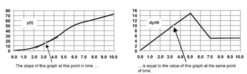
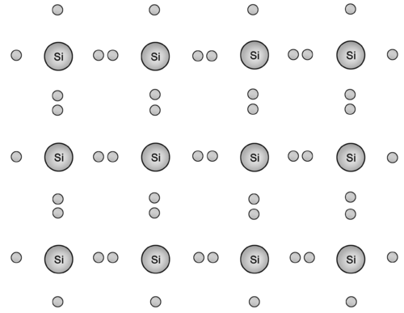

<!--
author:   Byron Philhour, Ph.D.; Maxwell Shapiro, Ph.D. 

email:    LiaScript@web.de

version:  0.0.1

language: en

narrator: US English Female

comment:  The Open Problems - Adventures in Physics FlexBook® is intended to be used as a multifaceted strategy to teaching Physics conceptually and mathematically. It is intended as a reference guide and source of practice problems covering Calculus based Physics.

logo:     ../cover.jpg

tags:      Physics, Calculus, practice, problems, science

-->

# Open Problems - Adventures in Physics

> This document was automatically translated to LiaScript from
>
> https://www.ck12.org/book/adventures-in-physics-open-problems/

## 1.0 Math Methods I

<article>

Open Problems - Adventures in Physics FlexBook 

**How to Use This Book**

We intend this book to be used as one part of a multifaceted strategy to teach physics conceptually and mathematically. It is intended as a reference guide and source of practice problems. This text is intentionally skeletal, not encyclopedic - we expect the student to bring this work alive with his or her own contributions.

**Why “open problems”?**

The term “open problem” refers to an unanswered question or unsolved mystery relevant to a particular field of study. Scientists, mathematicians and many others use a common, often rapidly evolving set of open problems as a focal point for dialogue about the direction of their discipline. (Lists of open problems in a variety of disciplines can be found on Wikipedia). The use of this term in the title of the book serves as a reminder that _although we are spending a lot of energy solving problems other folks have already tackled, we need to always be looking towards the problems that are still unsolved._

A second meaning is suggested by the title: we intend the problems in this workbook to be used, adopted and shared in the spirit of the open-source movement.

</article>

### 1.1 Vector Mathematics

<article>

#### Objectives

* Understand how a vector differs from a scalar.
* Add and subtract vectors with ease.
* Understand the purpose and use of the unit vectors **i, j, k**.
* Multiply vectors together in two different ways, finding both the dot (scalar) and cross (vector) products.

### Vectors

Vectors are abstract things, like numbers. They are used to represent values that have an intrinsic direction associated with them. Formally, they have only two properties: a _magnitude_ (or _length_) and a _direction_. Where a vector is thought to be _placed_ has no impact on its value or meaning — in other words, two vectors can be equal even if they are located at different points in space. We often represent vectors with arrows:

Some examples:

Mathematicians have discovered (invented? created?) ways to add, subtract and multiply vectors.

#### Addition of Vectors

_Two vectors must have the same_ units _to be added or subtracted from one another._

In practice, addition of two vectors consists of adding the $x$ and $y$ ($i$ and $j$) components separately. So, if $A = (5 \ m/s)i + (3 \ m/s)j$ and $B = (2 \ m/s)i +  (1 \ m/s)j$, the sum $A + B = (7 \ m/s)i + (4 \ m/s)j$.

If a vector is instead provided as a magnitude and a direction (for instance, $A = 5 \ \text{units}$ pointing at a $30^{\circ}$ angle above the $x$ axis) you will first convert to $i, j$ notation by noting that $A = 5 \cos (30^{\circ})i + 5 \sin(30^{\circ})j$ . This basic trig operation is likely familiar from your introductory physics course.

#### Multiplying a Vector by a Scalar

In practice, you multiply each component in the vector by the scalar in question. So, if $A = 5i + 3j$, then $2A = 10i + 6j, 0.5A = 2.5i + 1.5j$, and $-A = (-1)A = -5i - 3j$.

#### Subtraction of Vectors

Subtracting a vector is accomplished by just adding the negative of the second vector.

#### Multiplication of Vectors Part I: The scalar or “dot” product

It is generally true that $A \cdot B = B \cdot A$.

In practice, scalar multiplication of two vectors consists of multiplying the $x$ and $y$ ($i$ and $j$) components separately. So, if $A = 5i + 3j$ and $B = 2i + 1j$, the product $A \cdot B = (5 \cdot 2) + (3 \cdot 1) = 10 + 3 = 13$. If the vectors are instead provided as a magnitude and direction, the $|A| |B| \cos(\theta)$ formula is often easier.

#### Multiplication of Vectors Part II: The vector or “cross” product

It is generally true that $A \times B = -B \times A$. All this ‘-’ (minus) sign means is that the two vectors point in opposite directions due to the RHR.

#### Practice Problems

1.  $A = 4i + 3j$. $B = 6i$. What is $C = A + B$?

2.  $A= (2 \ m/s)i + (2 \ m/s)j$. $B = (4 \ m/s)j$. What is $C = A - B$?

3.  $A = (4 \ N)i + (3 \ N)j$. $B = (6 \ m)i$. What is $C = A \cdot B$?

4.  $A = (4 \ m)i + (3 \ m)j$. $B = (6 \ N)i$. What is $C = A \times B$?

5.  $A = 4i$. $B = -6i$. What is $C = A + B$?

6.  $A = (4 \ m/s)i$. $B = (3 \ m/s)i$. What is $C =A - B$?

7.  $A = (4 \ N)i$. $B = (13 \ m)i$. What is $C = A \cdot B$?

8.  $A = (4 \ m)i$. $B = (2 \ N)i$. What is $C = A \times B$?

#### Answers to Practice Problems

1.  $10i + 3j$
2.  $(2 \ m/s)i - (2 \ m/s)j$
3.  $24 \ N \cdot m = 24 \ J$
4.  $(-18 \ N \cdot m)k$
5.  $-2i$
6.  $(1 \ m/s)i$
7.  $52 \ N \cdot m = 52 \ J$
8.  0 (a vector with zero length)

</article>

### 1.2 Derivatives and Anti-Derivatives in Physics

<article>

#### Objectives

* Gain experience in finding the derivatives and anti-derivatives of functions.
* Interpret the meaning of a derivative or anti-derivative graphically.

### Differential Calculus

Derivatives of functions can be interpreted in several ways useful to us as physicists. For instance, when the function in question represents something that varies with time, the time-derivative can be interpreted as the rate of change of the function. So, for instance, if the number of cars parked in a parking lot as a function of time can be expressed by the function.

$$
N(t) = 5 + 2 \sin(3t) \qquad \qquad units: \text{cars}
$$

then the rate at which cars are entering and leaving the lot can be expressed by its derivative: 

$$
\frac{dN}{dt} = 6 \cos(3t) \qquad \qquad units: \text{cars per second}
$$

This rate is positive if cars are entering the lot and negative if cars are leaving the lot. As you likely already know, the derivative of a constant function is zero (since it doesn’t change).

It is assumed that you will be taking a calculus class concurrently with this course. For the purposes of our work, you’ll need to be able to

* take the derivative of a function involving a variable raised to a power. For instance, if $y(t) = 5t^2 + 3t + 1$ then $\frac{dy}{dt} = 10t + 3$.
* take the derivative of a function involving a trigonometric, logarithmic, or exponential expression. For instance, if $y(t) = 5 \ln(t) + \sin(t) + e^{at}$ (where $a$ is a constant) then $\frac{dy}{dt} = \frac{5}{t} + \cos(t) + ae^{at}$.
* take the derivatives of nested functions using the chain rule. For instance, if $y(t) = \sin(at^2)$ (again, where $a$ is a constant) then $\frac{dy}{dt} = 2 at \cos(at^2)$.
* interpret the derivative function as the instantaneous slope of the original function.

#### Anti-derivatives

Just as addition and subtraction “undo” one another (just as multiplication and division do), the process of taking a derivative has an opposite process: the anti-derivative. The symbol for the anti-derivative is a stylized $S$. Suppose you have a function $f(x)$ with derivative $g(x) = \frac{df}{dx}$. Then we can say that

$$
f(x) = \int \limits{g(x)} dx + C
$$

Two important points: first, for now (until you have further instruction in calculus), you can just ignore the deeper meaning of the stylized $S$ and the $dx$ that follows the function. Second, the letter $C$ stands for _any numerical constant_. Remember, of course, that if $f(x)$ has a constant value added to it (like 5, or 28, or 1,000,000), the constant value disappears when we take a derivative. So if you start with an anti-derivative $\frac{df}{dx}$ you don’t _really_ know everything you need to know about $f(x)$ — you don’t know the constant value. So we add it and call it $C$.

Again, it is assumed that you will be taking a calculus class concurrently with this course. For the purposes of our work, you’ll need to be able to

* find the anti-derivative of a function involving a variable raised to a power, for instance if $y(t) = 3t^2 + 4t + 1$, then $\int y(t) dt = t^3 + 2t^2 + t + C$. If you have not experimented with anti-derivatives before now, take a few moments to verify for yourself that the derivative of the second function above is just $y(t)$.
* find the anti-derivative of a function involving a trigonometric, logarithmic, or exponential expression. For instance, if $y(t) = \frac{5}{t} + \cos(t) + e^{at}$ (where $a$ is a constant) then $\int y(t) dt = 5 \ln(t) + \sin(t) + \frac{1}{a} e^{at}$.
* interpret the anti-derivative function as the “area under the curve” of the original function.

The explanation for _why_ a derivative can be thought of as an instantaneous slope whereas the anti-derivative can be thought of as the area under a curve — and why these are really just two inverse processes of each other — is known as the Fundamental Theorem of Calculus. It’s one of the “big ideas” of your calculus class. We won’t go into the details here, but we find it fascinating nonetheless.

#### Practice Problems

1. Find the derivative of $f(x) = 8 \sin(5x^3) + 3x^4 + 7$.

2. What is the instantaneous slope of the function $f(x) = 50x^2 + 4x + 1$ at the point $x = 3$?

3. Find the anti-derivative of $f(x) = 5x^3 + 2x + 1$.

4. What is the area under the curve of the function $f(x) = 3x^2 + 5$ between $x = 0$ and $x = 3$?

#### Answers to Practice Problems

1.  $120x^2 \cos(5x^3) + 12x^3$
2.  304
3.  $\frac{5}{4}x^4+ x^2+ x + C$
4.  42

</article>

## 2.0 Kinematics

<article>

</article>

### 2.1 Calculus Based Kinematics Principles

<article>

#### Objectives 

* Distinguish when to use the familiar kinematics equations for uniformly accelerated motion and when the use of these equations is inappropriate.
* Use the rotational analogues to position, velocity, and acceleration with fluency.
* Identify the “rolling without slipping” constraint and distinguish conditions under which an object might be both rolling _and_ slipping.

### Calculus-based Kinematics

Please take a moment to look over Appendix A (a review of introductory physics material).

Continuing to describe the position of an object as a function of time as $x(t)$.

* We define instantaneous velocity as

$$
v(t) = \frac{dx}{dt}
$$

Velocity is the instantaneous slope of a position vs. time function.

* We define instantaneous acceleration as

$$
a(t) = \frac{dv}{dt} = \frac{d^2x}{dt^2}
$$

Acceleration is the instantaneous slope of a velocity vs. time function, and is related to the _concavity_ of a position vs. time function.

* Although it is used less in practice, we can also define the instantaneous _jerk_ as

$$
j(t) = \frac{da}{dt} = \frac{d^2v}{dt^2} = \frac{d^3x}{dt^3}
$$

Some folks go on to define further derivatives as _snap_, _crackle_, and _pop_, but they’re probably just kidding around.

These relationships can also be expressed in terms of anti-derivatives:

* $x(t) = x_0 + \int v(t)dt$ (note that $x_0$ plays the role of the arbitrary constant ‘$C$’)
* $v(t) = v_0 + \int a(t) dt$
* $a(t) = a_0 + \int j(t) dt$

These equations are _more general_ and _more correct_ than the kinematics equations you learned about in your introductory physics course, since they work for any acceleration function $a(t)$, whereas the kinematics equations you learned about previously are only valid if the acceleration is a _constant_ in time.

#### Centripetal Acceleration

An object moving at constant speed $v$ through a turn with radius of curvature $r$ is accelerating towards the center of that turn according to the formula.

$$
a = \frac{v^2}{r}
$$

#### Rotational Kinematics

A very simple analogy is used to describe the _rotation_ of an object about a fixed point. The angle of rotation as a function of time is described (usually in radians) as $\theta(t)$. With this in mind:

* We define instantaneous angular velocity as

$$
\omega(t) = \frac{d \theta}{dt}
$$

Angular velocity is the instantaneous slope of an angle vs. time function.

* We define instantaneous acceleration as

$$
\alpha(t) = \frac{d \omega}{dt} = \frac{d^2 \theta}{dt^2}
$$

Again, angular acceleration is the instantaneous slope of an angular velocity vs. time function, and is related to the concavity of an angle vs. time function.

These rotational expressions can also be expressed in terms of anti-derivatives:

* $\theta(t) = \theta_0 + \int \omega(t)dt$ (note that $\theta_0$ plays the role of the arbitrary constant)
* $\omega(t) = \omega_0 + \int \alpha(t) dt$

These rotational quantities ($\theta$, $\omega$, and $\alpha$) are related to translational quantities (path length $s$, speed $v$, and tangential acceleration $a_t$) and the radius of rotation through the following equations.

* $s = r \theta$
* $v = r \omega$
* $a_t = r \alpha$

Rotational quantities are _vector_ quantities, with direction determined by the right-hand rule:

#### Rolling and Slipping

A circular object is spinning with angular velocity $\omega$. The edges of the object are moving _tangentially_ with instantaneous velocity $v = R \omega$, as shown here.

If this object is _rolling_ along the ground, so that its center moves with velocity $u$ with respect to the ground, the instantaneous velocity of the edge points all change as follows :

If the object moves with _just the right_ velocity $u = v = R \omega$, the point of contact between the object and the ground will have an instantaneous velocity of zero. This is called “rolling without slipping” - under normal circumstances, rolling wheels like those on your car or bicycle obey this condition. When rolling without slipping, the topmost point on a wheel has a rightward velocity of $2u$ relative to the ground; the center has speed $u$ relative to the ground; and the bottommost point is not moving relative to the ground. We’ll discover in later chapters that this occurs for a reason: any sliding will alter the rotational and translational velocities _until_ the rolling without slipping condition is met.

</article>

### 2.2 Kinematics Applications and Modeling

<article>

#### Objectives 

* Find the position and velocity of an object with an arbitrarily varying acceleration.
* Interpret graphs of position, velocity and acceleration with fluency.
* Model basic kinematic ideas in two dimensions using a spreadsheet program such as Excel.

#### Numerical Simulations

Practicing physicists use computers on a daily basis, not just for commercial applications but for programming as well.

We will assume basic familiarity with the Excel spreadsheet program. The best way to achieve this is to work an online tutorial. Here's one we can recommend - work through all the sections at your own pace, and keep a copy of Excel open to practice the ideas as you work:

* https://www.gcflearnfree.org/excel2016/

To simulate motion on a computer, you must teach it the most basic kinematics equations:

$$
\begin{align*}
\eqalign{
x_f &= x_i + v \Delta t\\
v_f &= v_i + a \Delta t
}
\end{align*}
$$

Here’s how implementation of these equations in one dimension might look in a spreadsheet:

|     |     |     |     |     |     |     |
| --- | --- | --- | --- | --- | --- | --- |
|     | **A** | **B** | **C** | **D** | **E** | **F** |
| **1** | “delta $t$” | “initial $x$” |     | “time” | “position $x$” | “velocity $v$” |
| **2** | 0.1 | 0.5 |     | 0.0 | \= $B$2 | \= $B$5 |
| **3** |     |     |     | \= D2 + $A$2 | \= E2 + F2\*$A$2 | \= F2 + $A$5\*$A$2 |
| **4** | “acceleration” | “initial $v$” |     | \= D3 + $A$2 | \= E3 + F3\*$A$2 | \= F3 + $A$5\*$A$2 |
| **5** | 2.5 | 0.0 |     | \= D4 + $A$2 | \= E4 + F4\*$A$2 | \= F4 + $A$5\*$A$2 |

For practice, use the grid below and a pencil and calculator to determine the values of the empty cells.

|     |     |     |     |     |     |     |
| --- | --- | --- | --- | --- | --- | --- |
|     | **A** | **B** | **C** | **D** | **E** | **F** |
| **1** | “delta $t$” | “initial $x$” |     | “time” | “position $x$” | “velocity $v$” |
| **2** | 0.1 | 0.5 |     | 0.0 |     |     |
| **3** |     |     |     |     |     |     |
| **4** | “acceleration” | “initial $v$” |     |     |     |     |
| **5** | 2.5 | 0.0 |     |     |     |     |

#### Numerical Simulation Mini-project

Test and expand your understanding by writing a projectile motion simulation that accomplishes the following:

* Given an initial position $(x_0, y_0)$, initial speed $(v_0)$, initial angle with respect to horizontal $(\theta _0)$, time interval $\Delta t$, and acceleration due to gravity $g$, calculate
    * The components of the initial velocity vector $(v_{0x}, v_{0y})$.
    * Data representing the position $(x(t), y(t))$, velocity $(v_x(t), v_y(t))$, speed, and angle $\theta$ with respect to the horizontal at equally spaced time intervals along its trajectory.
    * A plot of the trajectory of the projectile at appropriate time intervals (by trajectory, we mean a plot of $y$ vs. $x$ ... so each data point will correspond to a different point in time).
    * The total time of flight.
    * The range of the projectile (how far it travels horizontally before hitting the ground).

</article>

## 3.0 The Scientific Method

<article>

</article>

### 3.1 Introduction to The Scientific Method

<article>

#### Objectives 

* Discover and gain practice with a level-appropriate set of scientific skills.
* Understand that the scientific method cannot be defined simply; that, instead, it is better understood as a vast collection of attitudes, methods, procedures, experiences, and even social interactions.
* Know that one’s understanding of the scientific method will mature over time, particularly if one engages in real scientific work.

### Scientific Method

The following resource from CK-12 gives an expanded explanation of the Scientific Method:

* [Scientific Method](http://www.ck12.org/physics/Scientific-Methodology/lesson/Scientific-Method-PHYS/)

Scientific method refers to a body of techniques for investigating phenomena, acquiring new knowledge, or correcting and integrating previous knowledge. To be termed scientific, a method of inquiry must be based on gathering observable, empirical and measurable evidence subject to specific principles of reasoning. A scientific method consists of the collection of data through observation and experimentation, and the formulation and testing of hypotheses.

Although procedures vary from one field of inquiry to another, identifiable features distinguish scientific inquiry from other methodologies of knowledge. Scientific researchers propose hypotheses as explanations of phenomena, and design experimental studies to test these hypotheses. These steps must be repeatable in order to dependably predict any future results. Theories that encompass wider domains of inquiry may bind many independently derived hypotheses together in a coherent, supportive structure. This in turn may help form new hypotheses or place groups of hypotheses into context.

Among other facets shared by the various fields of inquiry is the conviction that the process must be objective to reduce biased interpretations of the results. Another basic expectation is to document, archive and share all data and methodology so they are available for careful scrutiny by other scientists, thereby allowing other researchers the opportunity to verify results by attempting to reproduce them. This practice, called _full disclosure_, also allows statistical measures of the reliability of these data to be established.

</article>

### 3.2 Graphing Nonlinear Data

<article>

#### Objectives 

* Understand how to manipulate data in order to generate linear data graphs that can be analyzed with a best-fit line.
* Learn to draw and analyze best-fit lines; use best-fit lines to describe the underlying physical model instead of using any particular data points.

### Graphing Nonlinear Data

Let’s say a mouse accelerates from rest away from the origin in the $+x$ direction. The following table of position vs. time is made.

|     |     |
| --- | --- |
| **Time $t$   ** | **Position $x$   ** |
| 0.00 | 0.00 |
| 0.21 | 0.04 |
| 0.42 | 0.17 |
| 0.59 | 0.32 |
| 0.79 | 0.65 |
| 1.04 | 0.98 |
| 1.19 | 1.27 |
| 1.40 | 1.98 |
| 1.60 | 2.59 |
| 1.81 | 3.20 |

What is the mouse’s acceleration? Not so easy to figure out! Here’s a clue: if you assume that position varies with time according to the equation.

$$
x(t) = \frac{1}{2}at^2
$$

then you can make a plot of $x$ vs. $t^2$. Not the difference here: we’re NOT graphing $x$ vs $t$, but $x$ vs the _square_ of time.

The reason this is an interesting thing to do is that if you plot $x$ vs $r^2$, the data should form a more-or-less straight line with slope $\frac{1}{2}a$. In other words, we’re noting that the equation

$$
x(t) = \frac{1}{2}at^2
$$

is very similar to the equation

$$
y = mx + b
$$

as long as you substitute $\frac{1}{2}a$ for $m$, $t^2$ for $x$, and 0 for $b$.

So: if you draw a “best fit” line, measure its slope, then multiply by 2, you’ve got the acceleration $a$. Try it!

Use the background grid here to make a plot of $t$ vs $x^2$, draw the best-fit line, and use the measured slope of the line to determine the mouse’s acceleration. Try to avoid just using any particular data point - the best-fit line should be a better measure of the underlying phenomenon than any of the individual data points.

This method works for all sorts of things. Basically, the idea is this: if you make the right choice of $x$ and $y$ axes, any function can be “linearized” (turned into a line) and the slope can be measured. You then use algebra to convert the slope into the value you seek. The reason you draw a “best fit” line is that it takes the underlying uncertainty in each measurement into account.

#### Determining the mass of the Sun

Let’s measure the mass of the Sun. According to Newton’s theory, the relationship between the orbital period $P$ of a planet, measured in seconds, and the average distance $a$ between the planet and the Sun, measured in meters, can be expressed as follows:

$$
P^2 = \frac{4 \pi^2}{GM_{sun}}a^3
$$

Begin by doing the proper unit conversions to get $P^2$ in square seconds and $a^3$ in cubic meters in the empty columns below.

You can find the conversion between Astronomical Units (AU) and meters online.

|     |     |     |     |     |     |     |
| --- | --- | --- | --- | --- | --- | --- |
| **Planet** | **$P$ (years)** | $a$ **(AU)** | **$P$ (seconds)** | **$a$ (meters)   ** | $P^2 \ (s^2)$ | $a^3 \ (m^3)$ |
| Mercury | 0.24 | 0.39 |     |     |     |     |
| Venus | 0.61 | 0.72 |     |     |     |     |
| Earth | 1.00 | 1.00 |     |     |     |     |
| Mars | 1.88 | 1.52 |     |     |     |     |
| Jupiter | 11.86 | 5.20 |     |     |     |     |
| Saturn | 29.46 | 9.54 |     |     |     |     |
| Uranus | 84.01 | 19.19 |     |     |     |     |
| Neptune | 248.54 | 39.53 |     |     |     |     |

Now plot $P^2$ vs. $a^3$ on the background grid below, draw a best-fit line, measure the slope of this best fit line $\left(\frac{4 \pi^2}{GM_{sun}}\right)$, and use this slope to determine the mass of the Sun. Compare your measured value to the accepted value (you can find this value online).

</article>

### 3.3 Quantifying Error

<article>

#### Objectives

* Gain experience in quantifying error using the %-discrepancy and %-error formalisms.
* Develop skills in analyzing error in a quantitatively appropriate way; in particular, an understanding that the numerical value for the error must be explained in addition to its qualitative source.

### Quantifying Error

The difference between two quantities is best characterized by a percentage.

#### Example #1

Let’s say you’re expecting some potatoes. Unfortunately, the punks at the potato company delivered 4 fewer potatoes than you were expecting! How angry should you be?

Well, if you were expecting 4 potatoes, then you should be very angry. If you were expecting 2500 potatoes, then maybe you should let it slide.

If you were expecting 4 potatoes, then they were off by 100% - a huge error on their part!

If you were expecting 2500 potatoes, and they only produced 2496 potatoes, then they were only off by $\frac{4}{2500} = 0.0016 = 0.16 \%$. A margin of error of 0.2% is probably more than you can expect when sorting and counting thousands of potatoes.

#### Formula #1

The “% difference” between expected and actual quantities can be expressed as follows:

$$
\% \ \text{difference} = \frac{| \text{expected} - \text{actual}|}{\text{expected}}
$$

Note that the absolute value sign ensures that the _% difference_ is always positive. 

#### Example #2

Sometimes it isn’t clear what is “expected” and what is not. Say you and a friend were both weighing your dog. Your friend measured 35.5 lbs, you measured 36.2 lbs. In this case there is no “expected” value - both values have equal validity. In this case, the formula changes slightly:

#### Formula #2

The “% difference” between two equivalent values can be expressed as follows:

$$
\% \ \text{difference} = \frac{|\text{value} \ \#1 - \text{value} \ \#2|}{\text{AVERAGE}}
$$

Where AVERAGE is the average of value #1 and value #2. (Some people divide by the smaller of the two so the % difference is maximized. We won’t bother with that, but you should know that happens from time to time.)

#### Practice

Calculate the % difference between the actual and expected values below.

1.  You were expecting 100 potatoes, but only received 95.

2.  You were expecting a force of 20 N, but only measured 18 N.

3.  You were expecting a mass of 1800.00 kg, but measured 1798.58 kg.

 

Calculate the % difference between the experiments below.

4.  You counted 305 penguins, but your partner counted 304 penguins.

5.  You predict a force of $8 \times 10^{-5} \ N$, but your buddy predicts a force of $5 \times 10^{-5} \ N$.

6.  You say there are 15 sunny days a year at SI, but your friend argues there are 16 sunny days a year at SI.

#### Further Practice

It is worth learning how to do % differences in your head. They can be a very quick way of determining how well an experiment is going DURING the experiment (rather than after, when all the equipment is put away).

TRY THESE IN YOUR HEAD before checking with a calculator.

1.  You predicted 10 N but measured 11 N.

2.  You predicted 100 kg but measured 118 kg.

3.  You predicted 20 kg but measured 19 kg.

4.  Your bill at the Stinking Rose was $80 but you put down $96.

5.  You got a 95 on the exam and your partner got a 105.

6.  You’re $5^{\prime}6^{\prime \prime}$ tall and your boyfriend is $6^{\prime}0^{\prime \prime}$ tall.

#### Rational Error Analysis

Let’s say you predicted a speed for an air track in the lab of 5.0 m/s and you measured 5.5 m/s, for a % difference of 10%. You write that this 10% error is due to friction. Why might your teacher take issue with you “explaining away” this 10% error with friction? What might be a better explanation?

</article>

## 4.0 Newton's Laws

<article>

</article>

### 4.1 Newton's Laws of Motion

<article>

#### **Objectives**

* Absorb, understand, and use Newton’s Laws of Motion with fluency, and commit them to memory.

**Newtonian Analyses of Motion**

Please take a moment to look over Appendix A (a review of introductory physics material).

* _Newton’s 1_st_ Law:_ How can you say what is moving and what is not? How can you feel that you are not moving, but at the same time know you are rotating about the Earth, orbiting the Sun, and flying through the Milky Way galaxy? Is there an “absolute” frame of reference from which you can measure all motion? Newton’s 1_st_ Law makes the claim that there is no “preferred” reference frame against which motion is measured. Any non-accelerating object or system can describe _itself_ as “at rest”. All velocities, then, must be measured relative to another object or system.
* _Newton’s 2_nd_ Law:_ The first law makes the claim that velocity is relatively meaningless in analyzing the motion of objects. The second law claims that _acceleration_ is central to understanding motion. Acceleration is more real: you feel it. If you accelerate, it is because an unbalanced force is acting on you. The 2__nd__ law relates the acceleration of an object or system to the net, unbalanced force acting on it and to the inertia (mass) of the system.

                                                                      $a=\frac{{F}_{net}}{m}$

* * In analyzing situations consisting of more than one object, you can write down Newton’s 2_nd_ Law for each object. Since Newton’s 2_nd_ law consists of an _equation_, it allows you to solve for an _unknown_. Thus, a system of four objects might need to be solved using _four equations_ to solve _four unknowns_.
    * Net forces generate accelerations, and these in turn are changes in velocity. These changes in velocity _need not_ be changes in speed — an object can accelerate without changing speed, as long as the velocity vector changes _direction_.
* _Newton’s 3_rd_ Law:_ when analyzing the motion of several bodies that are interacting with on another, you notice that all forces are _intrinsically mutual_. Like two sides of a single coin, each force is really two forces acting at once; they form a so-called ‘Third Law Pair’ that follows a specific set of rules. The two forces in a third law pair:
* * act on two different objects, never one a single object (or system)
    * are of the same t_ype_ (meaning both are normal forces, or both are tensional forces)
    * are equal in _magnitude_ (meaning if one is 10 N, so is the other)
    * are opposite in _direction_ (meaning if one points east, the other points west)
* Determining the third law pair force to any particular force is challenging for beginning students. There is a syntactic game you can play which helps with this. Consider the following two forces which form a third law pair:
* * “I am pushing on the wall towards the east with 20 N of force.”
    * “The wall is pushing on me towards the west with 20 N of force.”
* _Newton’s Universal Law of Gravity_ — often described as “Newton’s 4_th_ law”: This law relates the mutual forces between two objects as proportional to the product of their masses, and inversely related to the square of their center-to-center separation. Although it is adequate in describing the mechanics of spaceflight and the motion of planets in our solar system, it is actually inferior to (and has been replaced by) Einstein’s General Theory of Relativity — a theory of gravity that involves the notion of a curved space-time fabric upon which objects move in free fall. This concept goes beyond the level of this text/course.

</article>

### 4.2 Centripetal Motion

<article>

#### Objectives

* Learn to use centripetal force concepts and equations in appropriate circumstances; in particular, solve combined energy-centripetal force problems (such as the “loop-the\-loop” problem).

### Centripetal Motion

A very common stumbling block for introductory students is the notion that an object moving at constant speed might _still_ be accelerating, as long as the direction of its motion changes. An object moving at constant speed $v$ through a turn with radius of curvature $r$ is accelerating towards the center of that turn according to the formula

$$
a = \frac{v^2}{r}
$$

Such acceleration requires (per Newton’s 2_nd_ Law) a net, unbalanced force acting in the direction of the acceleration — again, towards the center of the turn. Forces and accelerations that point towards the center of a curve are known as _centripetal_. The word ‘centripetal’ describes the _direction_ of these forces and accelerations, not their _types_. In other words: sometimes a gravitational force is centripetal, sometimes it is not. Sometimes, a normal force is centripetal; sometimes it is not. Sometimes only a net force is centripetal, despite none of the constituent forces acting in a purely centripetal direction!

A common class of problems involve centripetal motion around a roller-coaster-like “loop-the-loop.” These can be tricky to solve because they involve using the energy perspective (to find the speed at some point along the coaster) and the Newtonian perspective (centripetal forces) together in a single problem. (One simplification you can exploit while working the mathematics of the solution is to notice that both the centripetal force equation $\frac{mv^2}{r}$ and kinetic energy equation $\frac{1}{2}mv^2$ each contain the common term $mv^2$.)

</article>

### 4.3 Advanced Newton's Laws Applications

<article>

#### **Objectives:**

* Display flexibility and ingenuity in applying Newton’s Laws to new problems involving motion in two and three dimensions.
* Work with standard force types, including normal, gravitational (as weight and also using the Universal Law of Gravity), tensional, frictional (static and kinetic), and spring forces.
* Solve problems involving multiple-body systems by (a) drawing independent free body diagrams for each body; (b) applying Newton’s 2nd Law; and (c) deriving and applying adequate constraint equations.
* Use rotated coordinate systems to analyze problems involving ramps and other angled surfaces.

**Multiple Objects and Constraints**

Consider the two-mass system below.

The analysis of the motion of this system involves a series of steps as follows:

* Draw free-body diagrams for each object. Each should include an upward tension force and a downward gravitational (weight) force.
* Use Newton’s 3_rd_ Law to identify the two tensions as a third-law pair force; note that pulleys allow the _directions_ of the pairs in this case to be the same. The unknown tension _T_  in this string is something you’ll be solving for.
* Write down Newton’s 2_nd_ Law for each of the two objects. This generates two new unknowns: the accelerations ${a}_{1}$ and ${a}_{2}$ of the two masses. But it also provides us with two equations.
* Use the fact that the _length_ of the rope stays the same as a “constraint” to manage these equations. Since the rope length can’t change, it must be that the accelerations of the two objects are equal and opposite, so ${a}_{1}={-a}_{2}$ . We now have an unknown acceleration $a$   for the system, where (say) ${a}_{1}=a$   and ${a}_{2}=-a$ .
* We now have two equations (Newton’s 2_nd_ Law for each object) and two unknowns ($a$   and $T$), and can solve using algebra.
* This method can be extended to three or more objects in a very natural way.

**Rotated Coordinate Systems**

When a majority of the forces identified in the analysis of a situation are oriented at angles to the standard $(x,y)$ coordinate system, it is often convenient to declare a new, rotated coordinate system $({x}^{'},{y}^{'})$ in which calculations are simplified. Consider the situation below, in which a wood block is sliding on a ramp. 

In this case, the normal force is oriented entirely in the ${y}^{'}$  direction. The friction force is oriented in the ${-x}^{'}$  direction. The only force that needs to be broken into components is the weight force. The components are ${W}_{x'}=Wsin(\theta)$  and ${W}_{y'}=Wcos(\theta)$.

(_Careful_: if you are used to the $x$\-component _always_ going with the cosine of the relevant angle, you should check the geometry here carefully.) Since the block is constrained to slide down (and not _into_) the ramp, we know that the acceleration is entirely in the ${+x}^{'}$ direction, and that there is no acceleration in the ${y}^{'}$ direction at all. This means we must have force balance in the ${y}^{'}$ direction, or that $N={W}_{y'}=Wcos(\theta)$ . The net force in the ${x}^{'}$ direction must be: 

$$
{F}_{net}={W}_{x'}-f=Wsin(\theta) -μN=Wsin(\theta)-μWcos(\theta)
$$

We can now note that $W=mg$ and that $a=\frac{Fnet}{m}$  to solve for the acceleration of the block down the ramp: 

$$
a=gsin(\theta) - μgcos(\theta)
$$

Such an analysis would be significantly more difficult in a non-rotated coordinate system.

</article>

##

<article>

</article>

### 5.1 Work Energy Theorem

<article>

#### Objectives:

* Recognize the Conservation Laws perspective as a second, parallel method for analysis of motion, distinct form the Newton's Laws perspective.
* Demonstrate facility in determining when a problem should be approached from a Newton's Laws perspective vs. a Conservation Laws perspective. Recognize that, at times, some problems involve using both treatments in concert.

### Work-Energy Theorem

* The concept of work connects the energy perspective to the force perspective.
* Work, like heat and radiation, is a concept used to represent the _transfer_ of energy from one object or system to another. An object or system doesn’t “have” work in the same way that it might “have” kinetic energy or potential energy. Instead, an object or system “does” work on another object or system, and in doing this work, energy transfers from one to the other. Work is a scalar quantity.
* Work changes your mechanical energy. So let’s say you have 60 J of kinetic energy and 40 J of potential energy, for a total of 100 J of mechanical energy. A friend pushes on you and does 20 J of work on you. You now have 120 J of mechanical energy, and your friend just lost 20 J of mechanical energy. Note that you are not yet sure if that 20 J of mechanical energy you gained went into your _kinetic energy_ (KE) or your _potential energy_ (PE): it would depend on the details of _how_ the friend delivered those 20 J. If she pushed horizontally on you, you might have sped up (gained KE), but if she lifted you, perhaps you gained PE.
* Work is the transfer of energy that arises through the application of a _force_. In comparison, heat is the transfer of energy that arises through the existence of a temperature difference (flowing from high temperature to low temperature). Both work and heat are measured in Joules \[J\] in the SI system.
* Only force directed _along the direction of motion_ does work. So, if you push vertically on something that moves horizontally even during your push, you will do no work - the object won’t gain or lose any kinetic or potential energy as a result.
* If the object is moving in the $x$ direction, only the $x$ component of the force will do work:

$$
\begin{align*}
\eqalign{
W & =F_x\Delta x \qquad \ \ \ \text{(force constant along motion)}\\
W & =\int F_x dx \qquad \text{(force varying along motion)} }
\end{align*}
$$

* If the force or path of motion are three-dimensional in nature, the work equation can be written more generally. Because force must act along the direction of motion to do work, we define work using a dot product:

$$
W=\int \overrightarrow{F}(\overrightarrow{r}) \cdot \overrightarrow{dr}
$$

In practice, in this course, you are much more likely to use the one-dimensional equation described in the previous bullet point than the one in this more generalized vector formula.

</article>

### 5.2 Force Impulse Theorem

<article>

#### Objectives:

* Use the relationship between impulse, force, and time to solve calculus-based problems involving these concepts.
*  Connect (conceptually and mathematically) the Conservation Laws and Newton's Laws perspectives through the analysis of work and impulse.

### Force-Impulse Theorem

* The concept of impulse connects the momentum perspective to the force perspective.
* Impulse is a vector quantity that represents the change in momentum a system experiences as a result of having a force act on it for some period of time.
* Impulse changes your momentum. So let’s say you have $150 \ kg \cdot m/s$ of momentum in the $+x$ direction. You experience a $30 \ kg \cdot m/s$ impulse in the $-x$ direction. You now have $120 \ kg \cdot m/s$ of momentum in the $+x$ direction.
* Impulse is measured in the same units as momentum, since it represents a change in momentum. An object or system can “have” momentum, but it cannot “have” impulse - instead, we say it _delivers_ or _receives_ an impulse.
* The direction of impulse is the same as the direction of net applied force. The longer the time period over which the force is applied, the greater the resulting impulse. We can define these mathematically:

$$
\begin{align*}
\eqalign{
\overrightarrow{J} = \overrightarrow{\Delta p} & = \overrightarrow{F} \Delta t \qquad \qquad \text{(force constant with time)}\\
\overrightarrow{J} = \overrightarrow{\Delta p} & = \int \overrightarrow{F} (t) dt \qquad \text{(force varying with time)}\\
\overrightarrow{F} (t) & = \frac{\overrightarrow{dp}}{dt} \qquad \qquad \ \ \ \text{(a different perspective on Newton's } 2^{\text{nd}} \text{ Law}\\
& \qquad \qquad \qquad \quad \ \text{comes from the derivative form of the same equation)}
}
\end{align*}
$$

* In the absence of an applied force, the momentum of an object or system doesn’t change. This idea is known as the Law of Conservation of Momentum. You likely learned to use this Law in your introductory physics course, solving problems in one dimension; in this course, you might be asked to apply it in two or more dimensions. It is important to recognize that momentum in the $x$ direction and momentum in the $y$ direction are separately conserved in the absence of an applied force.

</article>

### 5.3 Conservative Forces and Potential Energy Representations

<article>

#### Objectives:

* Discriminate between conservative and non-conservative forces; for conservative forces, learn to determine the corresponding potential energy function (and vice versa).
* Use the relationship between work, force, and distance to solve calculus-based problems involving these concepts.
* Recognize that the relationships between {impulse, force and time} and {work, force and distance} display a symmetry that can be exploited in coming to understand motion.

### Conservative Forces and Potential Energy Representations

* There is some built-in ambiguity in how we related forces to energies. For instance, with one force in particular (gravity), we rarely talk about the _work_ it does, instead describing its influence through potential energy. Let me explain: let’s say an object has 0 J of KE and is dropped from a tall building. We can either say (a) it started with 100 J of mechanical energy (in the form of potential energy) and converted this to kinetic energy as it fell - maintaining the same total mechanical energy throughout its fall **or** (b) it started with 0 J of mechanical energy, but gravity did 100 J of work on it as it fell, so it gained mechanical energy the entire time. Either of these explanations is valid. The question is: did you decide to describe gravity as a force that does work **or** as a potential energy? If you are clear about what you choose, it doesn’t matter what you choose.
* Let’s say we choose to describe gravity as a force that does work. Then the work done by gravity as something falls a distance $h=-\Delta y$ is given by the formula

$$
W = \int F_y (y) \cdot dy = \int (-mg) dy = -mg\Delta y = mgh
$$

* In the above case, it makes sense to describe gravity as a potential energy because it is a force that _conserves energy within a system_. We describe this as a conservative force. A non-conservative force would release energy from a system - an example of this is friction. Non-conservative forces must always be described from the work perspective - you cannot write down a potential energy function for them. However, for any conservative force, you _can_ write down a potential energy function, using the following formula:

$$
\begin{align*}
\eqalign{
U(x) & = -\int F_x dx \qquad \qquad \text{(for motion in one direction)}\\
U(\overrightarrow{r}) & = -\int \overrightarrow{F} (\overrightarrow{r}) \cdot \overrightarrow{dr} \qquad \text{(more generally)}\\
F_x & = -\frac{dU}{dx} \qquad \qquad \qquad \text{(derivative form of same equations)}
}
\end{align*}
$$

The minus sign just reminds us of the obvious: forces act in the direction that _reduces_ potential energy; so, for instance, the force of gravity points downward because objects _lose_ potential energy when they move downward. (This is a tough point and worth exploring and thinking deeply about.)

* Spring forces conserve energy, and so can be described through a potential energy function rather than as a force that does work:

$$
U(x)=-\int F_x dx =-\int (-kx) dx = \frac{1}{2}kx^2
$$

* In the absence of any non-conservative forces (such as friction, air resistance, and other forces that transfer energy _out of_ a system), mechanical energy stays constant. This is called the Law of Conservation of Energy - you have likely worked with his Law extensively in your introductory course.
* In all interactions, energy is conserved. In certain interactions, kinetic energy itself is _also separately conserved_. Such interactions are called _elastic_. During the time period in which an elastic interaction takes place, kinetic energy is briefly stored in potential energy and released.

### Graphical Representations of Force and Momentum

Likewise,

### Graphical Representations of Force and Potential Energy

Likewise,

</article>

### 5.4 Collisions

<article>

#### Objectives:

* Analyze collision problems in one or two dimensions involving elastic, totally inelastic, and partially inelastic collisions.

### Collisions

* When two objects collide, a transfer of energy and momentum between them may occur. Since both objects exert equal and opposite forces on each other during the collision (via Newtons 3_rd_ Law stating the fundamentally _mutual_ nature of force), no _net_ force is applied to a system consisting of _both_ objects. This means for the system consisting of both objects, momentum and energy are likely to be conserved.
* In all collisions, momentum of the two-object system is conserved: this means the horizontal and vertical components of momentum are each separately conserved. This is a hugely useful fact, one you should exploit. If both horizontal AND vertical momentum are conserved, you “get” two equations that you can use to solve for unknowns.
* In all collisions, energy is conserved globally, but perhaps “lost” from the system in sound, heat, etc., generated by non-conservative forces. In a collision where very little or no energy is “lost” from the system (that is, it is stored during the collision in a conservative force like an elastic force), we call the collision “elastic”. In these collisions, kinetic energy conservation gives you an additional equation that you can use to solve for unknowns.

</article>

## 6.0 Rotation from a Newton's Laws Perspective

<article>

</article>

### 6.1 Torque and Rotational Motion

<article>

#### Objectives:

* Solve problems involving rigid, rotating objects by relying on a set of analogies between Newton’s Laws in translational and rotational form.
* For systems where the net torque is zero (so-called static systems), use a set of equilibrium equations to solve standard problems.
* Be able to determine the net torque on a system and use this to determine the system’s angular acceleration (rotational form of Newton’s 2nd Law).

### Torque

Torque is a vector quantity used to describe how an applied force changes the rotational motion of an object. Consider a door rotating about a hinge: applying a force to the door at the hinge will not cause the door to begin opening or closing (or otherwise change its state of rotational motion). However, applying a force far from the hinge will work better: in fact, the farther from the hinge you push (the greater the so-called _moment arm_) the greater the door's motion will change. Likewise, the _direction_ of the applied force matters - push along the door (towards the hinge) and it won’t open or close, but push at a _right angle_ to the door and it opens easily. Torque is defined as a cross product between moment arm and applied force:

$$
\overrightarrow{\tau} = \overrightarrow{r} \times \overrightarrow{F}
$$

where $\overrightarrow{r}$ is a vector pointing from the pivot point to the point of application of the force.

One challenge with torques is to identify the exact point of application of a force, something you haven’t had to think about much up until now. Gravitational forces act at the center of mass of an object, which for symmetric objects is at the object’s center. Frictional and normal forces - all contact forces \- act where two surfaces are in contact.

#### Rotational Motion

You’ll recall from Chapter 2 (Kinematics) that you use rotation angle $\theta$, angular velocity $\omega$, and angular acceleration $\alpha$ to describe the motion of a rotating object. Consider the following possibilities of the rotation of a wood plank about a pivot point (marked as a black circle).

</article>

### 6.2 Center of Mass and Rotational Inertia

<article>

#### Objectives:

* Recognize that the gravitational torque on an object is applied at the center of mass; find the center of mass of simple objects.
* Describe the concept of rotational inertia and calculate the rotational inertia of combinations of simple objects; commit to memory a few important formulas for simple objects.
* Understand and make use of the parallel axis theorem when finding the rotational inertia of an extended object.

### Center of Mass

Gravitational torques act at the center of mass of an object. The center of mass of a symmetric object with uniform density (like, say, a flat coin) is easy to determine: it is just the geometric center of the object. For irregularly shaped objects, or objects with non-uniform density, we use calculus methods (described in Chapter 8) to determine the location of the center of mass.

#### Rotational Inertia

Just as the same net force will generate greater acceleration for an object with lower mass (inertia), the same net _torque_ will generate greater _angular_ acceleration for an object with lower _rotational inertia_.

Rotational inertia - the resistance of an object to changes in its rotational motion - depends on both the mass of the object and how the mass is distributed. More massive objects have greater rotational inertia; mass distributed farther from the center of rotation increases the rotational inertia even more. In general, a chunk of material with mass $m$ located a distance $r$ from the center of rotation will have rotational inertia

$$
I_{chunk} = mr^2
$$

A real object, like a baseball, consists of a lot of small chunks of material. If you add up all these chunks, you get the total rotational inertia of the baseball. Some chunks will be farther from the center, some closer. In general you write

$$
I = \sum\limits_{i} m_ir{_i}^2
$$

Some standard rotational inertia equations.

#### Newton’s 2_nd_ Law \- Rotational Analogy

The relationship between angular acceleration, net torque, and rotational inertia should look familiar:

$$
\alpha = \frac{\tau_{NET}}{I}
$$

Having worked with Newton’s Laws for some time, you likely will see the simple equation above as hiding a great deal of subtlety and power.

#### Parallel Axis Theorem

Objects that are rotating about a pivot point that is not at their center of mass have higher rotational inertia. In general

$$
I_{pivot} = I_{cm} + mr^2
$$

Now $r$ refers to the distance between two parallel axes, one passing through the pivot and a second one passing through the center of mass.

</article>

## 7.0 Rotation from a Conservation Laws Perspective

<article>

</article>

### 7.1 Rotational Kinetic Energy

<article>

#### Objectives:

* Differentiate between translational kinetic energy and rotational kinetic energy.
* Recognize that the addition of a rotational kinetic energy term does not require the addition of any kind of rotational potential energy term - potential energy transforms into two types of energy.

### Rotational Kinetic Energy

The total kinetic energy of an object in motion can be expressed as a sum of two forms of kinetic energy: the kinetic energy due to the _rotation_ of the object about some pivot point, and the kinetic energy due to the motion of that pivot point.

$$
K = \frac{1}{2}mv^2 + \frac{1}{2}I \omega^2
$$

Here, $I$ refers to the rotational inertia about the pivot point, which might differ from the rotational inertia about the center of mass.

_Helpful tip_: Recall that, in the special case of a circular object rolling without slipping, we have $v = R \omega$. Plugging $\omega = \frac{v}{R}$ in these cases can help reduce the algebraic complexity of the problem.

It is important to recognize that the _amount_ of kinetic energy in each of the two forms (translational vs. rotational) depends on your choice of pivot point. The _sum_ of the two, however, should not depend on this choice.

#### Rotational Work

Just as previously you saw that the total mechanical energy of a system can be changed through the application of a force over distance (so-called Work), so also the total mechanical energy can be changed through the application of a torque over some angle:

$$
W = \int \overrightarrow{\tau} \cdot \overrightarrow{d \theta}
$$

</article>

### 7.2 Angular Momentum

<article>

#### Objectives:

* Understand the concept of angular momentum, and solve problems involving conservation of angular momentum in the absence of a net torque.
* Describe and analyze elastic and inelastic collisions that now also involve the rotation of one or more interacting objects.

### Angular Momentum

A spinning object demonstrates stability against changes in its spin direction; you can see this with the action of a top, yo-yo, or even a motorcycle wheel. Just as we called the tendency to keep moving translationally “momentum”, we’ll call the tendency to keep moving rotationally ‘angular momentum’. The units of angular momentum are a bit unusual: $kg \cdot m^2/s$.

Angular momentum can be defined in two equivalent ways. The first is for a rigid, rotating body:  

$$
\overrightarrow{L} = I \overrightarrow{\omega}
$$

Here, the two vectors point in the same direction.

In more advanced courses, you might learn that $\overrightarrow{L}$ and $\overrightarrow{\omega}$ do not have to point in the same direction; for the purposes of this course, you’ll stick to situations where these do point in the same direction.

For example, the sphere shown below is rotating about an axis parallel to the long side of this page. Both its angular velocity and angular momentum point towards the top of the page.

The equation above describes the angular momentum of an object rotating about itself. However, an object moving with respect to some (arbitrarily defined) pivot point also can be said to have angular momentum. If $\overrightarrow{r}$ is a vector pointing from a pivot point to the object in question, and $\overrightarrow{p}$ is the (translational) momentum of that object, then the angular momentum is defined by a vector cross-product:

$$
\overrightarrow{L} = \overrightarrow{r} \times \overrightarrow{p}
$$

As usual, this cross product is zero if $\overrightarrow{r}$ and $\overrightarrow{p}$ are parallel to one another, and is maximized if the two are perpendicular to one another. Some examples:

#### Torque and Angular Momentum

Just as a net force alters the momentum of an object, a net _torque_ alters the _angular momentum_ of a system. The equations are so similar it is worth displaying them side by side:

$$
\begin{align*}
\eqalign{
\overrightarrow{\tau} &= \frac{\overrightarrow{dL}}{dt} \qquad \quad \ \ \overrightarrow{F} = \frac{\overrightarrow{dp}}{dt} \\
\overrightarrow{\Delta L} &= \int \overrightarrow{\tau} dt \qquad \overrightarrow{\Delta p} = \int \overrightarrow{F} dt
}
\end{align*}
$$

In the absence of a net torque, angular momentum is conserved in an interaction (such as a collision). In the presence of a net torque, the angular momentum will change in the direction of the net torque \- this phenomenon is known as _precession_.

</article>

## 8.0 Math Methods II

<article>

</article>

### 8.1 Finding Center of Mass and Rotational Inertia

<article>

#### Objectives:

* Find center of mass and rotational inertia of continuous (rather than discrete) mass distributions using integration methods.

### Center of Mass

For objects in a uniform gravitational field (like on the surface of the Earth), gravitational torques act at the center of mass. The center of mass of a symmetric object with uniform density (like, say, a flat coin) is easy to determine: it is just the geometric center of the object. When an object consists of several simple objects attached together, the center of mass can be found using a weighted sum. Let’s say you have three objects (1, 2, and 3), with masses $m_1$, $m_2$, and $m_3$ and center of mass positions $x_1$, $x_2$, and $x_3$. The center of mass of the combined object would be:

$$
x_{cm} = \frac{m_1x_1 + m_2x_2 + m_3x_3}{m_1 + m_2 + m_3}
$$

In general, for a set of $N$ discrete objects each labeled by an index $i = 0, 1, 2, 3, \ldots, N$, the center of mass can be found at

$$
x_{cm} = \frac{1}{M_{total}} \sum\limits_{i=1}^{N} m_ix_i \qquad \text{where} \qquad M_{total} = \sum\limits_{i=1}^{N} m_i
$$

Continuous objects can be thought of a very large (infinite) set of infinitesimally small (differential) discrete objects, each with tiny mass $dm$. When summing an infinite set of differential quantities, you use the integral notation rather than the sum notation (both, of course, refer to the letter S for “sum”):

$$
x_{cm} = \frac{1}{M_{total}} \int x dm \qquad \qquad \ \text{where} \qquad \qquad \ M_{total} = \int dm
$$

You use linear, area, and volume definitions of density to convert $dm$ into an integrable form:

$$
\begin{align*}
\eqalign{
\lambda & = \frac{M}{L} \qquad \text{linear density} \qquad \ \ \ dm = \lambda dL\\
\sigma & = \frac{M}{A} \qquad \text{area density} \qquad \quad \ dm = \sigma dA\\
\rho & = \frac{M}{V} \qquad \text{volume density} \qquad dm = \rho d V
}
\end{align*}
$$

#### Example 1: Slender rod with nonuniform density

Let’s say you have a rod of length $L$, but with a nonuniform density. The density increases along the rod, from a value of $\lambda_0$ at the left end to a value of $2 \lambda_0$ at the right end (represented by increased shading in the figure below). The density increases according to the formula

$$
\lambda (x) = \lambda_0 \left(1 + \frac{x}{L}\right)
$$

You’d expect, then, this object to be “weighted” towards the right end, and so the center of mass will be to the right of $x = \frac{L}{2}$, assuming $x = 0$ is the left end of the rod.

Let’s first determine the total mass of the rod in terms of density $\lambda_0$ and the length $L$:

$$
\begin{align*}
\eqalign{
M_{total} &= \int dm = \int \lambda dL = \int \lambda dx\\
& = \int\limits_0^L \lambda_0 \left(1+ \frac{x}{L}\right) dx \\
&= \lambda_0 x + \lambda_0 \frac{x^2}{2L} \Bigg |_0^L\\
& = \lambda_0 L + \lambda _0 \frac{L^2}{2L}\\
& = \frac{3}{2} \lambda_0 L
}
\end{align*}
$$

Now you can figure out the position of the center of mass

$$
\begin{align*}
\eqalign{
x_{cm} &= \frac{1}{M_{total}} \int x dm\\
& = \frac{1}{M_{total}} \int x \lambda dL\\
& = \frac{1}{\left(\frac{3}{2}\lambda_0 L \right)} \int\limits_0^L x \lambda_0 \left(1+ \frac{x}{L}\right)dx \\
&= \frac{1}{\left(\frac{3}{2} \lambda_0 L \right)} \left(\frac{\lambda_0 x^2}{2} + \frac{\lambda_0 x^3}{3L}\right) \Bigg|_0^L\\
& =\frac{5}{9}L
}
\end{align*}
$$

#### Example 2: Triangular wedge with uniform density

Now let’s consider a triangular wedge with side lengths $L$ and _uniform_ density $\sigma_0$ as shown. The total area is $A = \frac{L^2}{2}$ and the mass is $M = \sigma_0 A = \sigma_0 \frac{L^2}{2}$.

This slice has infinitesimally small width $dx$ and height $y = L - x$, so total area $dA = (L - x)dx$. This area is still infinitesimally small because its width is vanishingly small.

The position of the center of mass is then

$$
\begin{align*}
\eqalign{
x_{cm} &= \frac{1}{M_{total}} \int x dm\\
& = \frac{1}{M_{total}} \int x \sigma dA \\
&= \frac{1}{\left(\frac{\sigma_0 L^2}{2}\right)} \int\limits_0^L x \sigma_0 (L - x) dx \\
&= \frac{1}{\left(\frac{\sigma_0 L^2}{2}\right)} \left(\frac{x^2 \sigma_0 L}{2} - \frac{x^3 \sigma_0}{3} \right) \Bigg|_0^L \\
&= \frac{L}{3}
}
\end{align*}
$$

By symmetry, the position of the center of mass in the $y$ direction, $y_{cm}$, is also $\frac{L}{3}$.

### Rotational Inertia

The task of finding the rotational inertia of a continuous (rather than discrete) object follows a very similar sequence. For discrete objects, you’ll recall from Chapter 6 that for a collection of objects, in general you write

$$
I = \sum\limits_i m_i r{_i}^2
$$

Perhaps not surprisingly, then, you can write a calculus equation describing an infinite set of infinitesimally small objects

$$
I = \int r^2d m
$$

where $r$ is a variable describing the distance from the mass element $dm$ and the axis of rotation.

#### Example 1: Slender rod with uniform density

A rod with length $L$, mass $M$, and uniform density $\lambda_0 = \frac{M}{L}$ rotated about its end point has rotational inertia

$$
\begin{align*}
\eqalign{
I & = \int r^2 dm\\
& = \int\limits_0^L x^2 \lambda_0 dx\\
& = \frac{L^3}{3} \lambda_0\\
& = \frac{L^3}{3} \left(\frac{M}{L}\right)\\
& = \frac{1}{3}ML^2
}
\end{align*}
$$

#### Example 2: Circular thin disk with uniform density

A disk with radius $R$, mass $M$, and uniform density $\sigma_0 = \frac{M}{\pi R^2}$ rotated about an axis pointing through the center and perpendicular to the plane of the disk has rotational inertia

$$
\begin{align*}
\eqalign{
I & = \int r^2 dm\\
& = \int r^2 \sigma_0 dA\\
& = \int\limits_0^R r^2 \sigma_0 (2 \pi r dr)\\
& = 2 \pi \sigma_0 \frac{R^4}{4}\\
& = 2 \pi \frac{M}{\pi R^2} \frac{R^4}{4}\\
& = \frac{1}{2} MR^2
}
\end{align*}
$$

In the case above, note that we have identified rings of radius $r$ and thickness $dr$ as our “area elements.” The total area of such a thin ring is $2 \pi r dr$. We make this choice because these rings are the only shapes that consist of points _all the same distance_ $r$ _from the rotation axis_.

Derivations for all the standard rotational inertia formulas outlined in Chapter 6 can be easily found online. A small but important set of standard methods for calculating these should be committed to memory.

</article>

### 8.2 First Order Differential Equations

<article>

#### Objectives

* Set up and recognize the solutions for differential equations describing the motion of an object in the presence of air resistance.

### First-order Differential Equation

An object falling in the presence of air resistance displays increasing speed (up to a limit known as _terminal velocity_, which is defined below) while _simultaneously_ displaying decreasing acceleration. The force of air resistance increases with speed, reducing the net force to zero when the object is traveling so quickly that air resistance and gravity balance completely.

Let’s say that you drop an object from rest from a great height. Initially it accelerates at $g$ towards the ground. As it gains speed, an upward force (air resistance, also known as drag force) is applied with magnitude

$$
F_b = bv
$$

where $b$ is a constant with units of kg/s. This constant depends on the shape and mass of the object. The net downward force is then

$$
F_{net} = mg - bv
$$

Note that this force vanishes when

$$
mg = bv_T \qquad \text{or} \qquad v_T = \frac{mg}{b}
$$

We call this the _terminal velocity_.

In general, though, before the object reaches terminal velocity, you can use Newton’s 2_nd_ Law to describe the evolution of its velocity with time:

$$
ma = m \frac{dv}{dt} = F_{net} = mg - bv
$$

Manipulating the equation above you get

$$
\frac{dv}{dt} = g - \frac{bv}{m}
$$

This is a so-called _differential equation_. The solution to it is an **equation**, $v(t)$.

In a future college math course, you'll learn how to solve this equation. For now, let’s use the time-honored method of _beginning_ with the solution and seeing if the solution “works.” The _solution_ to this differential equation is the **equation**:

$$
v(t) = v_T \left(1-e^{-\frac{b}{m}t} \right)
$$

So, your task is to confirm that if you plug the solution

$$
v(t) = \frac{mg}{b} \left(1-e^{-\frac{b}{m}t} \right)
$$

into  

$$
\frac{dv}{dt} = g - \frac{bv(t)}{m}
$$

then the two sides of the equations will equal each other. Let’s call the left hand side of the equation LHS and the right hand side RHS and see if they’re equal.

$$
\begin{align*}
\eqalign{
\text{LHS} &: \frac{dv}{dt} = \frac{d}{dt} \left(\frac{mg}{b} \left(1-e^{-\frac{b}{m}t} \right)\right) = ge^{-\frac{b}{m}t} \\
\text{RHS}&: g - \frac{bv(t)}{m} = g  - \frac{b \frac{mg}{b} \left(1-e^{-\frac{b}{m}t}\right)}{m} = g - g + ge^{-\frac{b}{m}t} = ge^{-\frac{b}{m}t}
}
\end{align*}
$$

The LHS and RHS above match for all time $t$, so they are equal functions. This means that $v(t)$ is a sufficient solution to the differential equation, since plugging in $v(t)$ “works.”

The graph of $v(t)$ makes physical sense as well:

</article>

### 8.3 Second Order Differential Equations

<article>

#### Objectives

* Set up and recognize the solutions for differential equations describing the simple harmonic motion of a mass on a spring, a simple pendulum, and a physical pendulum.

### Second-order Differential Equation

#### Mass on a spring

An object that is displaced from equilibrium \- but experiences a _linear_ restoring force \- will exhibit simple harmonic motion.

For instance, imagine a small block with mass $m$ sitting at rest on a frictionless table. A spring with stiffness constant $k$ constrains the motion of the block - if it moves a distance $x$ left or right of equilibrium, the spring will apply a force opposing that motion with magnitude $F =-kx$.

Newton’s second law provides an equation of motion for the block:

$$
\begin{align*}
\eqalign{
F_{net} & = ma\\
-kx & = m \frac{d^2x}{dt^2} \quad \text{or} \quad \frac{d^2x}{dt^2} = -\frac{k}{m}x
}
\end{align*}
$$

The solution to this differential is _itself_ an equation, $x(t)$. Again, using the “guess and check” method, we’re going to _guess_ that the solution looks something like this:

$$
x(t) = x_0 \sin \left(\sqrt{\frac{k}{m}}t \right)
$$

So, to start, you’re going to plug this in to the equation $\frac{d^2x}{dt^2} = -\frac{k}{m}x$ and see if the left hand sides and right hand sides match!

$$
\text{LHS}: \frac{d^2x}{dt^2} = \frac{d}{dt} \left(x_0 \sqrt{\frac{k}{m}} \cos \left(\sqrt{\frac{k}{m}t}\right)\right) = -x_0 \frac{k}{m} \sin \left(\sqrt{\frac{k}{m}t}\right) = -\frac{k}{m}x = \text{RHS}
$$

More generally, both the sine and cosine functions have the interesting property that each time you take two derivatives you get a minus sign out and the original function back. So, the most general solution to this second order differential equation is

$$
x(t) = x_A \sin \left(\sqrt{\frac{k}{m}t}\right) + x_B \cos \left(\sqrt{\frac{k}{m}t}\right)
$$

Where $x_A$ and $x_B$ are constants that depend on the set up of the problem.

#### Simple pendulum

In the case of a pendulum, you analyze the torque acting on the pendulum bob due to gravity and derive an expression for the angle $\theta(t)$ the pendulum makes with vertical.

##### Torque Analysis

The tension force is directed radially, so it generates no torque about the axis of rotation.

The force of gravity generates a torque

$$
\tau = -mg L \sin(\theta)
$$

For small angles $\theta$, $\sin(\theta)$ and $\theta$ are roughly equal (check with your calculator - be sure you are in radian mode), so you can write

$$
\tau = -mg L \theta
$$

The minus sign comes from the RHR - note that if $\theta > 0$, the torque _opposes_ motion in that direction.

Now you can use the rotational form of Newton’s 2_nd_ Law to set up a differential equation.

$$
\begin{align*}
\eqalign{
\tau_{net} = I \alpha & = I \frac{d^2 \theta}{dt^2} \\
-mgL \theta &= I \frac{d^2 \theta}{dt^2} \qquad \text{or} \qquad \frac{d^2 \theta}{dt^2} = -\frac{mgL}{I}\theta
}
\end{align*}
$$

Finally you can plug in the rotational inertia of a small mass a distance $L$ away from the axis of rotation $(mL^2)$ to get a simple equation

$$
\frac{d^2 \theta}{dt^2} = -\frac{mgL}{mL^2} \theta \qquad  \text{or} \qquad \frac{d^2 \theta}{dt^2} = -\frac{g}{L} \theta
$$

This looks very similar to the differential equation for the mass on a spring, and so should have similar solutions:

$$
\theta(t) = \theta_A \sin \left(\sqrt{\frac{g}{L}t} \right) + \theta_B \cos \left(\sqrt{\frac{g}{L}}t \right)
$$

Again, the two constants $\theta_A$ and $\theta_B$ depend on the problem at hand.

#### Physical pendulum

A very similar analysis to that above extends to any object that acts as a pendulum under gravity \- even if this object is irregularly shaped. As long as you know where the center of mass is and what the rotational inertia of the object is, you can repeat the analysis above, this time calling $L_{cm}$ the distance from the pivot point to the center of mass and leaving the rotational inertia $I$ as an unknown.

$$
\begin{align*}
\eqalign{
\tau_{net} = I \alpha & = I \frac{d^2 \theta}{dt^2} \\
-mgL_{cm} \theta &= I \frac{d^2 \theta}{dt^2} \qquad \text{or} \qquad  \frac{d^2 \theta}{dt^2} = -\frac{mgL_{cm}}{I} \theta
}
\end{align*}
$$

The solutions are

$$
\theta(t) = \theta_A \sin \left(\sqrt{\frac{mgL_{cm}}{I}}t\right) + \theta_B \cos \left(\sqrt{\frac{mgL_{cm}}{I}}t\right)
$$

Again, the two constants $\theta_A$ and $\theta_B$ depend on the problem at hand.

</article>

## 9.0 Heat Engines and Thermodynamics

<article>

</article>

### 9.1 Heat Engines

<article>

#### Objectives:

* Build a working engine from basic materials through the Stirling Engine project (described below).
* Use the ideal gas model to understand how a heat engine functions.
* Understand and visualize a basic set of thermodynamic processes using pressure-volume diagrams.

### How a Heat Engine Works

* The material that follows will borrow heavily from the hands-on Stirling Engine project that accompanies this chapter. 

* Working fluid acts as an ideal gas, so the state variables $P$ (pressure), $V$ (volume), $N$ (number), and $T$ (temperature) are related by the ideal gas law:

$$
\begin{align*}
\eqalign{
PV &= NkT \qquad \qquad \text{where} \ N \ \text{is an integer and} \ k = 1.38 \times 10^{-23} \ J/K \\
PV &= nRT \qquad \qquad \text{where} \ n \ \text{is expressed in moles and} \ R = 8.31 \ J/mol \cdot K
}
\end{align*}
$$

  

* The conversion from integer $N$ to moles $n$ is accomplished through Avogadro’s number: 

$$
1 \ \text{mole} = 6.02 \times 10^{23} \ \text{items}
$$

* The internal energy of a gas is contained entirely in the kinetic energy of its constituent molecules, and is directly proportional to temperature

$$
U_{int} = \frac{3}{2}NkT = N < \frac{1}{2}mv^2 > _{avg}
$$

* Heat $(Q_{in})$ flows into the system from a high-temperature reservoir (in the case of our Stirling engine, the flame of a candle) and flows out of the system $(Q_{out})$ into a low-temperature reservoir. This can be the ambient air or, in the case of the Stirling engine, some ice in a tray at the top of the machine.
* Manipulating the gas allows it to do work on the environment around it. In the case of our Stirling engine, this mostly amounts to keeping the flywheel turning despite frictional energy losses.
* If a working fluid expands against its outside environment, it does work $W = P \Delta V$ (this energy needs to come from somewhere, either the heat into the system or the internal energy of the gas). The gas can compress when work is done to it - again using the formula $W = P \Delta V$. (More generally, work is the _area_ under the curve on a pressure-volume diagram.)
* The various manipulations one can perform on a working fluid are called _thermodynamic processes_ and include
    * _Isothermal expansion and compression_. For these, the temperature and therefore total internal energy of the system stays constant, meaning all the heat in $Q_{in}$ is converted to work $W$ done on or by the environment (depending on if it was an expansion or compression.) So: $Q_{in} > 0$, $\Delta U = 0$, so $W > 0$ and $W = Q_{in}$.
    * _Adiabatic (isentropic) expansion and compression_. For these, no heat flows into the working fluid. Any work done by (or to) the gas is realized in a change in internal energy of the gas. So $Q_{in} = 0, W > 0$ so $\Delta U < 0$. Since internal energy changes, either number or temperature must change as well.
    * _Isochoric heating and cooling_. The gas does no work during an isochoric (constant volume) process. However, the gas gains or loses pressure and energy depending on the amount of heat flowing into or out of the working fluid. Since internal energy changes, either number or temperature must change as well.
    * _Isobaric expansion and compression_. For these, the pressure stays constant during the expansion. Here we can have $Q_{in} \neq 0$, $W \neq 0$ and $\Delta U \neq 0$, depending on the circumstances. During an isobaric expansion, the gas cools and does work on the environment around it.
* The efficiency of a heat engine is the ratio of work delivered to heat input: $\varepsilon = \frac{W_{net}}{Q_{in}}$. The ideal efficiency of the Carnot cycle predicted by Sadi Carnot is related only to the temperatures of the heat source and heat sink in the system: $\varepsilon_{ideal} = 1 - \frac{ T_{low}}{T_{high}}$.
* Engine processes are _cyclical_.

A useful tool for analysis of heat engines and thermodynamic processes in general - akin to the free body diagram used in Newtonian force analysis - is the _pressure-volume_ (more briefly, PV) diagram. Here are a variety of processes as demonstrated on PV diagrams.

First working Stirling Engine built at St. Ignatius College Prep by student Megan McCarthy '08

As of this writing, her video of the engine has 170,000 views on You Tube: [http://www.youtube com/watch?v=yR19RCriMZU](http://www.youtube%20com/watch?v=yR19RCriMZU) 

!?[0](https://www.youtube.com/watch?v=yR19RCriMZU)

#### The Stirling Cycle

The four steps in the Stirling cycle look like this:

* Gas starts at high volume (balloon out), low pressure (gas at top of engine where temperature is low).
* _Isothermal compression of the gas_: The balloon is pushed down by connecting rod, compressing the air, most of which (due to the position of the displacer) is located at the top of the engine. Process is isothermal because gas is compressed while attached to an ice bath at the top of the engine. This ice bath absorbs heat from the gas. So, all the work done in compressing the gas is converted into heat dumped into the ice. The internal energy of the gas does not change, nor does its temperature, during this part of the engine cycle.
* _Isochoric process:_ The displacer moves upward, pushing the gas down the walls of the pressure vessel. The volume doesn’t change - the gas just moves from one place to another (top of the engine to the bottom). The pressure of the gas increases, but this is just because its temperature increases. Its temperature increases because it is absorbing heat from the walls of the engine as it moves down to the hotter bottom part.
* _Isothermal expansion of the gas_: The bulk of the working fluid (air) is now located at the bottom of the engine, where it is heated by the tea candle. The gas throughout the engine expands, pushing out on the balloon. This is the “power stroke” of this engine: this is what pushes the balloon, and its connecting rod, to turn the flywheel against its frictional losses.
* _Isochoric process_: The displacer moves downward, pushing the gas up the walls of the pressure vessel. The volume doesn’t change - the gas just moves from one place to another (bottom of the engine to the top). The pressure of the gas decreases, but this is just because its temperature decreases. Its temperature decreases because it is losing heat to the cooler walls of the engine as it moves up to the cooler top part.

</article>

### 9.2 The Laws of Thermodynamics

<article>

#### Objectives: 

* Recognize and work with the laws of thermodynamics.

#### Laws of Thermodynamics

* _First Law_
    * In any process, the total energy of the universe remains constant. \[Wikipedia\]
    * “You can’t win.” \[Allen Ginsberg\]
    * The total energy of the universe always stays the same. Energy can only be converted from one form to another. \[common\]
* _Second Law_
    * There is no process that, operating in a cycle, produces no other effect than the subtraction of a positive amount of heat from a reservoir and the production of an equal amount of work. \[Wikipedia\]
    * “You can’t break even.” \[Allen Ginsberg\]
    * During exchanges of energy, some amount is always converted into a random form (thermal energy). \[common\]
    * The entropy of a closed system is statistically bound to increase. \[common\]
* _Third Law_
    * As temperature approaches absolute zero, the entropy of a system approaches a constant. \[Wikipedia\]
    * “You can’t quit.” \[Allen Ginsberg\]
    * If all thermal and kinetic energy is removed from a system, the system’s temperature is absolute zero. Thanks to the Second Law, this state is impossible to achieve. \[common\]
* _“Zeroth” Law_
    * If two thermodynamic systems are in thermal equilibrium with a third, they are also in thermal equilibrium with each other. \[Wikipedia\].
    * (Note that the “Zeroth” Law is a common-sense notion that was introduced as an axiom for philosophical reasons. We will not dwell on it.)

</article>

## 10.0 Special Relativity

<article>

</article>

### 10.1 Understanding Special Relativity

<article>

#### Objectives:

* Understand the concept of a reference frame, and how a change in reference frame affects the coordinates of an event.
* Find the coordinates of an event in a reference frame moving close to the speed of light using Lorentz transformations and the theory of Special Relativity.

### Transformations Between Reference Frames

According to Einstein and the Lorentz transformation, the coordinates of a space time event measured at time $t$ and position $x$ will be measured in a moving reference frame (at velocity $v$, a.k.a. dimensionless velocity $\beta = \frac{v}{c}$ and “boost factor” $\gamma = \frac{1}{(1- \beta^2)^{\frac{1}{2}}}$ at coordinates

$$
\begin{align*}
\eqalign{
x^{\prime} &= \gamma(x - \beta ct) \\
ct^{\prime} &= \gamma(ct - \beta x)
}
\end{align*}
$$

The purpose of this transformation is to ensure Einstein’s postulate: that all observers measure the same _maximum_ speed for the universe \- the speed light happens to travel at, $c$.

Contrast this with the usual Galilean transformation that matches our intuition:

$x^{\prime} = x - vt$ _i.e.,_ the moving person sees the event farther than farther behind her.

$t^{\prime} = t$

And note that at low speed ($\beta \approx 0$ and $\gamma \approx 1$) the two transformations match one another - this is because $c$ is so very high compared to $v$.

1. You light a match at ($x = 2.0 \ m$, $t = 0.0 \ s$) and extinguish the match at ($x = 2.0 \ m$, $t = 3.0 \ s$).

a. Calculate the coordinates of these events using the Galilean transformation for a person in a car moving by at 20 m/s.

Lighting match:

$$
\begin{align*}
\eqalign{
x^{\prime}&= x - vt \\
&= 2.0 - (20 \ m/s)(0) \\
&= 2.0 \ m \\
t^{\prime} &= t= 0.0 \ s
}
\end{align*}
$$

Extinguishing match:

$$
\begin{align*}
\eqalign{
x^{\prime} &= x - vt \\
&= 2.0 - (20 \ m/s)(3.0 \ s) \\
&= -58.0 \ m \\
t^{\prime} &= t = 3.0 \ s
}
\end{align*}
$$

Makes sense - in those 3 seconds we moved a long way away!

b. Calculate the coordinates of these events using the Lorentz transformation for a person in a spacecraft moving by at $\frac{1}{2}$ the speed of light. (Hint: leave $c$ as $c$ - don’t plug in the numerical value.)

$\beta = 0.5, \gamma = 1.155$

Lighting match:

$$
\begin{align*}
\eqalign{
x^{\prime} &= \gamma(x - \beta ct) \\
&= 1.155(2.0 - (0.5)c(0.0)) \\
&= 2.31
}
\end{align*}
$$

$$
\begin{align*}
\eqalign{
ct^{\prime} &= \gamma(ct - \beta x) \\
&= 1.155(c(0.0) - (0.5)(2.0)) \\
&= -1.155
}
\end{align*}
$$

Extinguishing match:

$$
\begin{align*}
\eqalign{
x^{\prime} &= \gamma(x - \beta ct) \\
&= 1.155(2.0 - (0.5)c(3.0)) \\
&= 2.31 - 1.73 c
}
\end{align*}
$$

$$
\begin{align*}
\eqalign{
ct^{\prime} &= \gamma(ct - \beta x) \\
&= 1.155(c(3.0) - (0.5)(2.0)) \\
&= 3.47 c - 1.155
}
\end{align*}
$$

c. In your reference frame, the time elapsed between striking and extinguishing the match was 3 seconds. How long was this elapsed time seen from the moving frame? 

$$
\begin{align*}
\eqalign{
\Delta t^{\prime} & = \frac{ct^{\prime} - ct^{\prime}}{c}\\
& = \frac{3.47 c - 1.155 -(-1.155)}{c}\\
& = 3.47 \ \text{seconds}. \text{ Wow}!
}
\end{align*}
$$

The upshot here is that if you insist that all observers measure the same speed of light, regardless of their velocity relative to the source of the light, you have to give up on very fundamental ideas about the universe. In Einstein’s model,

* the time elapsed between two events depends on your frame of reference.
* the distance between two events depends on your frame of reference.
* two events that are simultaneous in one frame of reference need not be simultaneous in another frame of reference.
* every observer measures the same speed for a beam of light, regardless of reference frame.

What is really important is that the universe has a _maximum speed_. In our universe, it so happens that light travels at that maximum speed in a vacuum, so the maximum is called _light speed_. But this discussion has nothing to do with light _per se_.

#### Matrix Mathematics and the Lorentz Matrix

Using matrix mathematics simplifies the approach to Lorentz transformations. If the coordinates of some specific event are described as ($x$, $y$, $z$, $ct$) in one reference frame and the coordinates of the same event as ($x^{\prime}$, $y^{\prime}$, $z^{\prime}$, $ct^{\prime}$) in a second reference frame moving with dimensionless velocity $\beta$ (boost factor $\gamma$) along the $x$ axis, you can use the following matrix multiplication to convert between these:

$$
\begin{align*}
\begin{bmatrix}
ct^{\prime} \\
x^{\prime} \\
y^{\prime} \\
z^{\prime}
\end{bmatrix} = 
\begin{bmatrix}
\gamma & -\beta \gamma & 0 & 0 \\
-\beta \gamma & \gamma & 0 & 0 \\
0 & 0 & 1 & 0 \\
0 & 0 & 0 & 1 \\
\end{bmatrix}
\begin{bmatrix}
ct \\
x \\
y \\
z
\end{bmatrix}
\end{align*}
$$

The trick to multiplying these matrices is as follows:

* To calculate the first term in the column to the left of the equals sign $(ct^{\prime})$, multiply - one-by-one - the elements of the top row of the $4 \times 4$ matrix times the elements of the rightmost column and then add these together.

$$
ct^{\prime} = \gamma ct - \beta \gamma x
$$

* The second term you get by multiplying each of the elements in the second row of the $4 \times 4$ matrix times the elements of the rightmost column.

$$
x^{\prime} = -\beta \gamma ct + \gamma x
$$

* Note that the zeroes in the matrix require that $y^{\prime} = y \ \text{and} \ z^{\prime} = z$. There is no Lorentz contraction or boost in directions perpendicular to the relative direction of motion of the two reference frames.

#### Spacetime Diagrams - Conceptual

The algebra for special relativity can be awkward. However, it translates very nicely to graphical form via the spacetime diagram. Spacetime events are plotted as points on a spacetime diagram - the _coordinates_ of those points are measured in different ways for different reference frames. Here’s an example for a speed of $v = 0.25 c$. Note that the angle the space and time axes make is equal to the inverse tangent of $\beta = \frac{v}{c}$:

The rules for measuring the spacetime coordinates of an event are as follows:

* To find the $x^{\prime}$ coordinate of an event, draw a line parallel to the $ct^{\prime}$ axis from the event and see where it intercepts the $x^{\prime}$ axis.
* To find the $ct^{\prime}$ coordinate of an event, draw a line parallel to the $x^{\prime}$ axis from the event and see where it intercepts the $ct^{\prime}$ axis.

It is important to emphasize that the two axes are scaled differently. If you want to make direct measurements off a graph, you’d need to take this into account. We’ll maintain a fairly conceptual viewpoint in this chapter to avoid dealing with this complication.

#### World Lines

The _world line_ of an object is its path through spacetime. The graph below demonstrates the world lines for (A) an object at _rest_ in the $(x, ct)$ reference frame and (B) an object _at rest_ in the $(x^{\prime}, ct^{\prime})$ reference frame. Note that each appears to be moving in the other reference frame, as expected.

The tangent of the angle that the world line of a stationary object makes with respect to the base reference frame is equal to the speed of that object compared to the speed of light. Since the speed of light cannot be exceeded, the fastest objects won’t “tilt over” by more than 45°.

#### Light Rays

The world line of a light ray is at 45°. Shown below is a light ray traveling along its world line. Note that the light ray passes through two photogates at spacetime events A and B.

Notice that for a light ray, the change in position $\Delta x = x_B - x_A$ must have the same “length” as the change in time $\Delta ct = ct_B - ct_A$ - this is what it means to say the world line is at a 45° angle. But most importantly, notice that the same is true for the $(x^{\prime}, ct^{\prime})$ coordinates - both reference frames measure the speed of light to be the same. You can tell this because the intervals - shown by the two double-headed arrows, are the same length in the $(x^{\prime}, ct^{\prime})$ reference frame. So both observers measure the same _speed_ of light, even if they measure different coordinates (and even intervals) for the position of light at any time.

#### Simultaneity and Length

Events that happen at the same time in one reference frame might not occur at the same time in a different reference time. To check the simultaneity of events, draw lines parallel to the space ($x$ or $x^{\prime}$) axis through one event - if the same line passes through the second event, they are simultaneous. Some lines of simultaneity are shown below.

To measure the length of something, you have to measure the positions of its ends simultaneously. Since simultaneity depends on reference frame, so shall length. Events C and D could only be used to measure the length of an object accurately in the $(x, ct)$ frame, and events A and D could only be used to measure the length of an object accurately in the $(x^{\prime}, ct^{\prime})$ frame. Again, remember that the $x$ and $x^{\prime}$ axes (as well as the $ct$ and $ct^{\prime}$ axes) are scaled differently, so this might not be visibly obvious from these graphs.

</article>

### 10.2 Using Diagrams to Represent Special Relativity

<article>

#### Objectives:

* Visualize the Lorentz transformations through the use of spacetime diagrams.

### Spacetime Diagrams - Conceptual

The algebra for special relativity can be awkward. However, it translates very nicely to graphical form via the spacetime diagram. Spacetime events are plotted as points on a spacetime diagram - the _coordinates_ of those points are measured in different ways for different reference frames. Here’s an example for a speed of $v = 0.25 c$. Note that the angle the space and time axes make is equal to the inverse tangent of $\beta = \frac{v}{c}$:

The rules for measuring the spacetime coordinates of an event are as follows:

* To find the $x^{\prime}$ coordinate of an event, draw a line parallel to the $ct^{\prime}$ axis from the event and see where it intercepts the $x^{\prime}$ axis.
* To find the $ct^{\prime}$ coordinate of an event, draw a line parallel to the $x^{\prime}$ axis from the event and see where it intercepts the $ct^{\prime}$ axis.

It is important to emphasize that the two axes are scaled differently. If you want to make direct measurements off a graph, you’d need to take this into account. We’ll maintain a fairly conceptual viewpoint in this chapter to avoid dealing with this complication.

#### World Lines

The _world line_ of an object is its path through spacetime. The graph below demonstrates the world lines for (A) an object at _rest_ in the $(x, ct)$ reference frame and (B) an object _at rest_ in the $(x^{\prime}, ct^{\prime})$ reference frame. Note that each appears to be moving in the other reference frame, as expected.

The tangent of the angle that the world line of a stationary object makes with respect to the base reference frame is equal to the speed of that object compared to the speed of light. Since the speed of light cannot be exceeded, the fastest objects won’t “tilt over” by more than 45°.

#### Light Rays

The world line of a light ray is at 45°. Shown below is a light ray traveling along its world line. Note that the light ray passes through two photogates at spacetime events A and B.

Notice that for a light ray, the change in position $\Delta x = x_B - x_A$ must have the same “length” as the change in time $\Delta ct = ct_B - ct_A$ - this is what it means to say the world line is at a 45° angle. But most importantly, notice that the same is true for the $(x^{\prime}, ct^{\prime})$ coordinates - both reference frames measure the speed of light to be the same. You can tell this because the intervals - shown by the two double-headed arrows, are the same length in the $(x^{\prime}, ct^{\prime})$ reference frame. So both observers measure the same _speed_ of light, even if they measure different coordinates (and even intervals) for the position of light at any time.

#### Simultaneity and Length

Events that happen at the same time in one reference frame might not occur at the same time in a different reference time. To check the simultaneity of events, draw lines parallel to the space ($x$ or $x^{\prime}$) axis through one event - if the same line passes through the second event, they are simultaneous. Some lines of simultaneity are shown below.

To measure the length of something, you have to measure the positions of its ends simultaneously. Since simultaneity depends on reference frame, so shall length. Events C and D could only be used to measure the length of an object accurately in the $(x, ct)$ frame, and events A and D could only be used to measure the length of an object accurately in the $(x^{\prime}, ct^{\prime})$ frame. Again, remember that the $x$ and $x^{\prime}$ axes (as well as the $ct$ and $ct^{\prime}$ axes) are scaled differently, so this might not be visibly obvious from these graphs.

</article>

## 11.0 Advanced Topics In Electricity and Magnetism

<article>

</article>

### 11.1 Silicon and Electrical Elements

<article>

#### Objectives: 

* Develop a model for understanding the behavior of doped semiconducting materials.
* Form a conceptual understanding of the operation of semiconductor devices (such as diodes and transistors).

### Silicon

Despite the fact that the word silicon has a ubiquitous affiliation with all things electronic, Si itself is _not_ a good electrical conductor. It has 4 valence electrons, meaning that filling its outer shell it can form a very strong lattice with 4 neighboring Si atoms-with no un-bonded electrons remaining. Here’s an example of what this lattice might look like; bear in mind that (a) we are only drawing in the four valence electrons, not the lower electrons in the atom (nor the nuclei); and (b) the lattice itself is 3-dimensional, not 2-dimensional. This diagram is just meant to be suggestive of a more basic property: that if each Si atom can share four electrons, it will share with four adjacent Si atoms so that every atom is sharing _all_ of its valence electrons, and each atom has a “complete” shell of eight electrons.

Feels like a long time since you took Chemistry, doesn’t it?

Since there are no “extra” valence electrons in this configuration able to travel from atom to atom as electric current, we describe silicon as an insulator. Semi-conductors consist of _doped_ silicon, as described next.

##### Doping & N-type Semiconductors

_Doping_ is the process of adding the occasional non-silicon atom within this lattice. To get a semi-conductor, you must engage in this type of doping. Let’s say you want to make an N-type semiconductor - this means we want an extra electron in the valence shell of the doping material (since electrons are _negative_, this is why they are N-type). Looking at a periodic table, the element arsenic (As) has five valence electrons rather than four. So, if you take a sample of silicon and _replace_ some of the silicon atoms with arsenic atoms, you’ll generate a material with a set of excess electrons, as (again, schematically) represented below.

The arsenic-doped silicon shown above will better conduct electricity, because, if you apply an electric field to it, the loosely bonded valence electrons brought in by the arsenic atoms will flow through it. We call this kind of semiconductor N-type because there is an extra valence electron, and electrons are negatively charged. WARNING: the material itself, of course, is still electrically neutral, since the arsenic atom also comes with an extra proton.

##### Doping & P-type Semiconductors

P-type semiconductors are made by doping silicon with an atom that has only three valence electrons, generating a “hole” in its valence shell, as shown below. Gallium works nicely.

P-type semiconductors are also electrically neutral; the gallium atom is missing both an electron _and_ a proton compared to the silicon atoms. But the gallium atom seeks an electron\-not because it is positively charged, but because it has an incomplete valence shell. This electron-seeking behavior brands it as “positive,” or P-type. The missing valence electron is described as a “hole.” P-type semiconductors also better conduct electricity than silicon, not because they have extra electrons, but because any available electrons can use the “holes” as a kind of freeway to move across the lattice.

#### Diodes

Below is a sketch of a simple diode consisting of a junction between an N-type and P-type semiconductor. The diode is attached to a battery. Excess valence electrons, like those found in conductors (like copper) and in N-type semiconductors, are drawn as solid black circles. “Holes,” like those found in P-type semiconductors, are drawn as open circles.

As you’ll recall from your introductory physics course (and, again, in just the simplest sense), a battery draws electrons from the positive terminal (shown at left above) and, via a chemical reaction, gives them potential energy as they flow out the negative terminal (shown at right above). The electrons in the right-side of the circuit above flow into the P-type region, filling those holes. Likewise, electrons in the N-type region move leftward away from the point of contact between the N-type and P-type materials. What is left, then, is an _insulating_ region between the N-type and P-type blocks. The diode is “off,” and no current can flow through it, as if a switch were simply turned off:

Now you flip the battery, so that the positive terminal is aligned with the P-type part of the junction.

With the battery in this orientation, the electrons flow clockwise, passing into the P-type region from the N-type region. The holes readily accept excess electrons, and current flows as usual. The diode is now “on” and presents near-zero electrical resistance. In this sense an N-P junction diode acts as a “one-way” gate for current-electrons can flow through it in one direction but not the other. Like the empty seat in a game of musical chairs, the holes appear to move in a counter-clockwise direction. By convention we choose the direction the _holes_ move as the direction of positive current.

#### Transistors

A transistor is formed by sandwiching one type of doped semiconducting material between two samples of the opposite type \- one can form NPN transistors (see below) or PNP transistors.

If you _lower_ the voltage of the base in comparison to the emitter, electrons from the base flow into the P-type region, with electrons filling the holes. As a result, this central P-type area no longer has any free valence electrons _or_ holes and, like silicon, becomes an insulator. Thus, by lowering the voltage of the base (remember: electrons flow _uphill_ in voltage), you effectively “turn off” any current flow that might pass through the transistor from the collector to the emitter.

If, instead, you _raise_ the voltage of the base, electrons from the N-type regions can flow through the P-type region holes, and a current can be sustained from the collector to the emitter.

In this sense, a transistor is an _electronic switch_. By controlling the electric potential of the base, you can control the amount of current that flows from the collector to the emitter. A great analogy is that of a sluice gate: imagine water that flows from the collector, through the transistor, to the emitter. If you lower the voltage of the base, it’s like pushing in a wedge at the position of the base, limiting the flow of water. If you raise the voltage of the base, the electrons back out of the P-type region, much like a sluice gate being pulled out of a stream.

The transistor is represented as a circuit element as follows:

In digital circuits, you only deal with two voltage levels: ON (+5 V) and OFF (0 V or ground). When the base is ON, current can flow from collector to emitter - they are at the same voltage as a result. When the base is OFF, current cannot flow from collector to emitter - they do not need, then, to be at the same voltage. No current flows into the base of a transistor - the visual model to have is a huge pipe carrying current from collector to emitter, with a small control gate (the base) that doesn’t really draw water.

</article>

### 11.2 Digital Logic and Electric Flux

<article>

#### Objectives: 

* Solve problems involving digital logic and transistors as a basis for understanding how computers work.
* Learn how to calculate and visualize electric flux; use Gauss’s Laws and the concept of flux to calculate the electric field around non-point objects.
* Develop a conceptual understanding of how capacitors work; calculate the capacitance for simple geometric shapes.

### Digital Logic

In digital circuits, typically only two voltages are applied: +5 V, or “ON”, and 0 V, or “OFF.”

The diagram shown is known as an _inverter_ or NOT logic circuit. When the INPUT is ON (+5 V) electrical current can flow from the collector to the emitter. This means current is flowing through the resistor. As a result, the OUTPUT is at 0 V, since there must be a voltage drop across the resistor since current is flowing through it. When the INPUT is OFF (0 V), electrical current cannot flow through the circuit, meaning that voltage drop across the resistor must be 0 V. If the drop is zero, the bottom of the resistor \- at OUTPUT - must be at the same voltage as the top. So, the OUTPUT is 5 V. To summarize:

|     |     |
| --- | --- |
| **INPUT** | **OUTPUT** |
| ON  | OFF |
| OFF | ON  |

Try it yourself!

Consider the AND logic circuit shown at below.

Analyze the circuit in order to fill out the following logic table:

|     |     |     |
| --- | --- | --- |
| **INPUT A** | **INPUT B** | **OUTPUT** |
| OFF | OFF |     |
| ON  | OFF |     |
| OFF | ON  |     |
| ON  | ON  |     |

_Answers: Logic table for AND gate_

|     |     |     |
| --- | --- | --- |
| **INPUT A** | **INPUT B** | **OUTPUT** |
| OFF | OFF | **OFF** |
| ON  | OFF | **OFF** |
| OFF | ON  | **OFF** |
| ON  | ON  | **ON** |

Figure out how to design an OR circuit on your own with the following logic table.

|     |     |     |
| --- | --- | --- |
| **INPUT A** | **INPUT B** | **OUTPUT** |
| OFF | OFF | OFF |
| ON  | OFF | ON  |
| OFF | ON  | ON  |
| ON  | ON  | ON  |

_OR circuit_

Note that the right side of this is just the NOT circuit from earlier in the chapter. It is not uncommon in digital circuits to string together basic elements.

#### Electric Flux

In your introductory course, you likely learned how to calculate the electric field in the proximity of a point charge. The formula, Coulomb’s Law, looked like this

$$
\overrightarrow {E}(r) = \frac{kq}{r^2}
$$

where $k$ is a constant of nature $(k = 9 \times 10^9 \ N \cdot m^2/kg^2)$, $q$ represents the charge in Coulombs of the source of the electric field, and $r$ is the radial distance. The direction of the electric field is directly away from positively charged objects, directly towards negatively charged objects.

Coulomb’s Law is useful for point charges; however, for more complicated objects, it runs into problems. What if, for instance, you had a long thin electrical cable that gained a uniform electric charge? Or a flat metal plate with a net negative charge-like one you might find on an external defibrillator? The electric fields of these are more complex, and require a more subtle approach.

_Electric flux_ is defined as the flow of electric field lines away form sources (positive charges) and towards sinks (negative charges). In the event that the electric field is uniform in magnitude and direction, flux is simply the product of electric field strength and the area through which it passes:

$$
\Phi_E = \overrightarrow{E} \cdot \overrightarrow{A}
$$

(Note the dot-product, which means that the electric field must _pierce_ the area in question. The area vector has magnitude equal to the area in question, and points in a direction perpendicular to the bounded surface.)

Conceptually, many physicists think of the flux of field lines as proportional to the “number” of field lines. Of course, since field lines are really tangent curves to an underlying vector field, and since this vector field is valued at every point in space, it really doesn’t make sense to talk about “number” in anything but a relative sense.

#### Gauss’s Law

Gauss’s Law goes one step further than Coulomb’s Law, and can be applied to a variety of geometrical charge configurations. It relates the flux through a _closed_ surface (any imaginary surface) to the net electrical charge _enclosed by_ that surface.

$$
\Phi_E = \overrightarrow{E} \cdot \overrightarrow{A} = \frac{q_{net}}{\varepsilon_0} \qquad closed \ surfaces \ only
$$

where $\varepsilon_0 = 8.85 \times 10^{-12} \ C^2/N \cdot m^2$ is called the permittivity of free space.

##### Deriving Coulomb’s Law from Gauss’s Laws

You can extract Coulomb’s Law from Gauss’s Law. Consider an imaginary sphere of radius $r$ centered on a small point-like object with net electrical charge $+q$. The area of this sphere is $4 \pi r^2$, so

$$
\begin{align*}
\eqalign{
\Phi_E &= E(4 \pi r^2) = \frac{q}{\varepsilon_0} \\
E &= \frac{q}{4 \pi \varepsilon_0 r^2} = \frac{kq}{r^2}
}
\end{align*}
$$

Note that the constant $k$ is actually just a convenient way of expressing the permittivity of free space.

$$
k = \frac{1}{4 \pi \varepsilon_0}
$$

##### Charged Thin Line or Rod

In class your instructor will likely derive the electric field in the region sorrounding a long, thin line or rod with uniform electric charge density $\lambda = \frac{q}{L}$.

$$
\overrightarrow E = \frac{\lambda}{2 \pi \varepsilon_0 r} \quad (\text{pointing radially outward from a positively charged line})
$$

##### Charged Flat Plate

In class, your instructor will likely derive the electric field in the region above and below a flat plate with uniform electric charge density $\eta = \frac{E}{A}$.

$$
\overrightarrow{E} = \frac{\eta}{2 \varepsilon_0} \quad (\text{pointing perpendicular away from a positively charged plate})
$$

#### Electrical Capacitance

As an object gains electric charge (or rather, as an imbalance in charge in the object becomes exaggerated), it becomes increasingly difficult to continue to change its charge. Imagine that you remove electrons from an object, so that it gains a net positive charge. It will become increasingly hard to remove electrons, since the positive charge of the object will pull on these electrons harder and harder.

Ultimately, you need to apply a greater and greater _voltage_ to pull a greater amount of _charge_ off of (or onto) an object. The relationship between these quantities is known as the electrical capacitance of the object.

$$
Q=CV
$$

Capacitance $C$ has units of Coulombs per Volt, also known as Farads.

#### Relationship between Potential and Field

As you’ll recall from Chapter 5, a relationship exists between the potential energy of an object as a function of its position and the force acting on that object:

$$
\begin{align*}
\eqalign{
U(x) &= -\int F(x) dx \\
F(x) &= -\frac{dU}{dx}
}
\end{align*}
$$

Recognizing that the potential energy is related to electric potential (voltage) through the relationship

$$
U(x) = qV(x)
$$

and that the electric field and electric force are similarly related, as shown next:

$$
F(x) = qE(x)
$$

You can rewrite the first two equations as

$$
\begin{align*}
\eqalign{
qV(x) &= -\int q E(x) dx \\
qE(x) &= -q \frac{dV}{dx}
}
\end{align*}
$$

Canceling the charge $q$, you arrive at a fundamental set of relationships:

$$
\begin{align*}
\eqalign{
V(x) &= -\int E(x) dx \\
E(x) &= -\frac{dV}{dx}
}
\end{align*}
$$

In the simple case, when the electric field and/or potentials are not varying with distance, these can be simplified ever further:

$$
\Delta V = E \Delta x
$$

That is, the change in electric potential (voltage) is just the electric field times the distance.

</article>

### 11.3 Magnetism

<article>

#### Objectives: 

* Learn how to calculate and visualize magnetic flux, and use Faraday’s Law to calculate the induced _emf_ in a circuit when the magnetic flux through it varies with time.
* Develop a conceptual understanding of how inductors work.

### Magnetic Flux

Magnetic flux is defined in precisely the same way as electric flux: as a product of the strength of the field and the area through which the field lines are passing. As with electric flux, it is defined in terms of a vector dot product:

$$
\Phi_B = \overrightarrow{B} \cdot \overrightarrow{A}
$$

#### Magnetic Induction

As you learned in your introductory course, charged objects generate an electric field, and electrical currents (charged objects in motion) generate magnetic fields. But you'll also recall this fundamental idea that motion at constant speed should be _indistinguishable_ from “rest.” An interesting question arises: let’s say you are next to stream of flowing electrons and measure a magnetic field. Then you speed up until you are moving at the same rate as the electrons. To you, they appear to be at “rest.” Is there still a magnetic field?

The resolution to this apparent paradox is that the electric and magnetic fields are _interchangeable_ depending on your frame of reference. A moving electric field generates an apparent magnetic field; a moving magnetic field generates an apparent electric field.

The generation of electric potential (voltage) through a varying magnetic field is described by Faraday’s Law:

$$
\varepsilon = -\frac{d \Phi_B}{dt}
$$

here, $\varepsilon$ denotes the _electromotive force_ (a perhaps confusingly named term-it is measured in units of Volts and can be used in practice like an electric potential) generated in a conducting path and the right hand side refers to the rate of change of the magnetic flux through that path. The negative sign gives rise to Lenz’s Law: current flows in the conducting path to attempt to create a magnetic field that resists the change in magnetic flux.

##### Self-induction

A device that generates a magnetic field-like a coil of wire-can experience magnetic _self-induction_ if a time-varying current is passed through it. Under these circumstances the induced voltage across the device can be expressed as

$$
V = -L \frac{dI}{dt}
$$

Here, $L$ refers to the magnetic self-inductance (or simply inductance) of the device, measured in Henrys, and the derivative is the time rate of change of the current through the device.

A simple wire coil with $N$ turns, cross-sectional area $A$, and length $l$ (lower-case $L$) has magnetic self-induction.

$$
L = \frac{\mu_0 N^2 A}{l} \qquad \text{here} \ \mu_0 = 4 \pi \times 10^{-7} \ T \cdot m^2/A \ \text{is the permeability of free space}
$$

</article>

### 11.4 RC and LC Circuits

<article>

#### Objectives: 

* Conceptualize how circuits involving combinations of resistors, capacitors, and inductors will work.
* Gain experience in electronics by building real and virtual circuits involving all of these new elements.

### RC and LC Circuits

The three “passive” circuit elements (resistors, capacitors, and inductors) in combination with voltage sources (batteries, wall outlets, and so on) and switches (mechanical or electronic in the form of transistors), can be combined to make all sorts of interesting and useful electric circuits. Let’s review the basic set of passive elements:

t

##### RC Circuits

Consider the circuit represented by the diagram shown here. At first the switch is open and the capacitor is completely uncharged. When the switch is closed, current will begin flowing out of the voltage source, through the resistor, and into the capacitor. No current flows _across_ the capacitor-it represents an open circuit.

At first, there is very little charge on the capacitor, so $Q = CV = 0$, and so the voltage across the capacitor is zero. This means the entire voltage drop $V_0$ occurs across the resistor, and the current through the resistor is $I = \frac{V_0}{R}$ - the highest it will ever be!

As the capacitor begins to fill, it gains charge and the voltmeter begins to register a voltage. Since there is now a drop across the capacitor, there must be a _smaller_ drop across the resistor. This means the current through the resistor must be smaller as well. The circuit is beginning to slow down! Eventually, the capacitor is fully charged to $Q = CV_0$ and no current flows through the resistor. This takes a characteristic time given by the formula.

$$
\tau = RC \qquad \ldots \text{ measured in seconds}
$$

The differential equation describing the current flowing through the circuit can be determined by analyzing all the voltage drops in the circuit:

$$
V_0 - IR + \frac{Q}{C} = 0
$$

Taking one derivative of this entire equation gives you

$$
R \frac{dI}{dt} + \frac{1}{C}I = 0
$$

Simplifying you see

$$
\frac{dI}{dt} = -\frac{1}{RC}I
$$

It is worth taking the time to verify that the following is an adequate solution

$$
I(t) = \frac{V_0}{R}e^{\frac{-t}{RC}} \qquad \ldots  \text{ the current exponentially decays, as described}
$$

##### LC Circuits

Consider the circuit represented by the diagram shown here. At first both switches are open and the capacitor is completely uncharged. When the leftmost switch is closed, the capacitor will begin to charge in exactly the way described previously (it’s just an RC circuit). Once the capacitor is charged, open the leftmost switch and forget about that side of the circuit.

Now you close the second switch. What happens? Charge immediately begins to flow out of the capacitor and through the wires that make up the inductor. But the rapid change in current makes the inductor resist the flowing current with a “_back-emf_.” It takes some time for the current to “get up to speed”: flowing out of the capacitor due to this inductive behavior. The system begins to oscillate with a characteristic time given by the formula

$$
\tau = \sqrt{LC} \qquad \ldots \text{ measured in seconds}
$$

The differential equation describing the charge stored in the capacitor can be determined by analyzing all the voltage drops in the (right-most portion of the) circuit:

$$
-L\frac{dI}{dt} = \frac{Q}{C}
$$

but noting that $I = \frac{dQ}{dt}$ ... that is, current is just the rate at which charge flows, you can see that

$$
-L \frac{d^2Q}{dt^2} = \frac{Q}{C}
$$

or

$$
\frac{d^2Q}{dt^2} =-\frac{1}{LC}Q
$$

Again, it is worth taking the time that the following is an adequate solution to this equation: 

$$
\begin{align*}
\eqalign{
Q(t) &= A \sin \left(\frac{2 \pi}{\sqrt{LC}}t \right) + B \cos \left(\frac{2 \pi}{\sqrt{LC}}t \right) \qquad  \qquad \qquad \ldots \text{ take a derivative of this to get current} \\
I(t) &= \frac{2 \pi}{\sqrt{LC}} A \cos \left(\frac{2 \pi}{\sqrt{LC}}t \right) - \frac{2 \pi}{\sqrt{LC}} B \sin \left(\frac{2 \pi}{\sqrt{LC}}t \right) \quad \ldots \text{ the current oscillates with time}
}
\end{align*}
$$

Figure out how to design an OR circuit on your own with the following logic table. _Again, answers will be provided on the next page._

</article>

## 12.0 Quantum Mechanics

<article>

</article>

### 12.1 The Wave Function and Schrödinger's Equation

<article>

#### Objectives: 

* Begin to grapple with certain fundamental quantum mechanical principles that describe systems at the smallest scales.
* Compare and contrast quantum mechanics with the more familiar Newtonian dynamics.
* Understand and describe the intuition behind the Schrödinger equation.

### The Wave Function

The wave function is the quantum entity which replaces the classical concept of a particle’s position. According to the uncertainty principle, there is a fundamental constraint on how precisely one can know a particle’s position and momentum at one time:

$$
\Delta x \cdot \Delta p \ge \frac{\hbar}{2}
$$

where $\Delta x$ is the uncertainty in the particle’s position, $\Delta p$ is the uncertainty in the particle’s momentum, and $\hbar = \frac{h}{2 \pi} = 1.05 \times 10^{-34} \ J \cdot s$ ($h = 6.36 \times 10^{-34} \ J \cdot s$ is Planck’s constant). This constraint is not a practical matter—that is, we couldn’t just build a better detector in order to measure the position to infinite precision. Instead, quantum mechanics forces us to deal in the language of probabilities: there is a non-vanishing probability of a particle being located anywhere within a distance $\Delta x$ about the position $x$, and $\Delta x \neq 0$ unless $\Delta p = \infty$ in such a way that the uncertainty principle is satisfied.

The probability of a particle being at any position $x$ is described by the particle’s wave function $\Psi(x)$ (this is for one dimension; in general, $\Psi$  could depend on all three spatial dimensions, but in this chapter the focus is on the one-dimensional case for simplicity). In order to compute the probability of a particle being between two positions $x_i = a$ and $x_f = b$, one integrates $|\Psi(x)|^2$ in between these positions:

$$
\left\{\text{Probability}\right\} = \int\limits_a^b \Big|\Psi(x)\Big|^2 dx
$$

Since the particle must be _somewhere_ in space, the probability of finding the particle between the positions $x = -\infty$ and $x = +\infty$ must be equal to one:

$$
\int\limits_{-\infty}^{+\infty} \Big|\Psi(x)\Big|^2 dx = 1
$$

This is called the normalization condition.

#### The Schrödinger Equation

For a single particle of mass $m$ traveling in a potential $V(x)$, the time-independent equation of motion of the system is the Schrödinger equation

$$
E \Psi(x) = -\frac{\hbar^2}{2 m} \frac{d^2 \Psi (x)}{dx^2} + V(x) \Psi(x)
$$

where $E$ is the total energy of the particle, $\Psi(x)$ is the particle’s wave function, and $\frac{d^2}{dx^2}$ is the second derivative with respect to position.

Although the Schrödinger equation might seem intimidating (after all, it is difficult to solve the second-order differential equation for a general potential, and we haven’t even included time yet), it is in fact nothing more than an expression of energy conservation. The total energy is given by the $E \Psi(x)$ term and is equal to the sum of the potential energy $(V(x)\Psi(x))$ and kinetic energy $\left( \left(\frac{-\hbar^2}{2 m}\right) \frac{d^2 \Psi}{dx^2}\right)$. The reason that the second term can be interpreted as the kinetic energy of the particle is subtle but may be clearer after you complete Practice Test A.

</article>

### 12.2 Quantum Mechanics Examples

<article>

#### Objectives:

* Apply the Schrödinger equation to two canonical examples: the particle in a box and the harmonic oscillator.

#### The Particle in a Box

We now consider an example potential to explore an important quantum mechanical system. Suppose a particle of mass $m$ is subjected to the following potential:

$$
\begin{align*}
V(x) = 
\begin{cases} 
0 & -\frac{L}{2} < x < \frac{L}{2} \\
\infty & \text{otherwise} 
\end{cases}
\end{align*}
$$

The particle is said to be confined in a box because the infinite potential energy barriers at $x = -\frac{L}{2}$ and $x = \frac{L}{2}$ prevent the particle from penetrating beyond these positions. However, if the assumption of infinite barriers is relaxed, then there is a non-zero probability for the particle to penetrate the finite barrier. This is called _quantum tunneling_ and is fundamentally different than the case of a classical particle.

The boundary conditions imposed by the infinite potential barriers are

$$
\Psi \left(x = -\frac{L}{2}\right) = 0 \qquad \Psi \left(x = \frac{L}{2}\right) = 0
$$

The reason that these conditions have to be met is that the particle has zero probability for being outside of the region $-\frac{L}{2} \le x \le \frac{L}{2}$ and $\Psi(x)$ is a continuous function.

Given the boundary conditions above and the Schrödinger equation, one can solve for the allowed energy values that the particle can take. The set of allowed energies is called the _energy spectrum_ and, in contrast to a classical particle, is _not_ continuous. The spectrum is said to be _discretized_ or _quantized_. Since this feature of the Schrödinger equation is ubiquitous (that is, that wave equations with boundary conditions result quite generally in discrete energy spectra), this is the reason for calling the field quantum mechanics in the first place!

As you will prove in Practice Test B, the allowed energy values are given by

$$
E = \frac{n^2 \pi^2 \hbar^2}{2 mL^2}
$$

where $n$ is any non-negative integer.

#### The Harmonic Oscillator

Now consider the harmonic oscillator as a second example. The reason that the quantum harmonic oscillator is so ubiquitous is not only because it’s one of a select few problems that can be solved exactly, but also because even quite exotic potential energy functions can be approximated as harmonic oscillators about their minimum potential energies (see Practice Test A).

The classical harmonic oscillator is usually described in terms of a mass on a spring according to the quadratic potential

$$
V(x) = \frac{1}{2} m \omega^2 x^2
$$

where $m$ is the mass of the oscillator and $\omega$ is the angular frequency of the oscillation. Putting this form of the potential energy into the Schrödinger equation, one can solve the differential equation for the wave functions $\Psi(x)$ and the corresponding allowed energies for the quantum mechanical analogue. The wave functions $\Psi(x)$ obtained in this way are related to a special set of functions called the Hermite polynomials, although the procedure for obtaining them is beyond the scope of this text.

The most important feature of this solution is that the energy spectrum is given by

$$
E = \hbar \omega \left(n + \frac{1}{2}\right)
$$

where $n$ is any non-negative integer. The energy for the $n = 0$ case is $E = \frac{1}{2} \ \hbar \omega$, which very importantly is _not zero_. We say that the harmonic oscillator has a zero-point energy. This is a very profound statement because it means that a certain energy is associated with the oscillator even when it has minimal kinetic energy and a wave function localized at $x = 0$ (strictly, the oscillator cannot be at rest and precisely located at $x = 0$ due to the uncertainty principle).

</article>

## 13.0 Appendix A: Review of Introductory Physics

<article>

</article>

### 13.1 Review of Introductory Physics

<article>

### Review of Introductory Material

Success in this course depends upon your proficiency with the following concepts gained in your previous, introductory course:

* description of the position of an object as a function of time as $x(t)$
* definition of average velocity as $v=\frac{\Delta x}{\Delta t} = \frac{x_f-x_i}{t_f-t_i}$ ... alternatively, $x_f=x_i+v\Delta t$
* definition of average acceleration as $a = \frac{\Delta v}{\Delta t} = \frac{v_f-v_i}{t_f-t_i}$ ... alternatively, $v_f=v_i+a \Delta t$
* use of the centripetal acceleration equation $a=\frac{v^2}{r}$ for objects moving through a turn at constant speed.
* use of the following equations of motion for uniformly accelerated motion:
    * $x(t)=x_0+v_0t+\frac{1}{2} at^2$
    * $v(t)=v_0+at$
* application of the equations of motion for the specific case of projectile motion (in which case the only force acting is a vertical gravitational force):
    * $x(t)=x_0+v_{0x} t$
    * $y(t)=y_0+v_{0y} t-\frac{1}{2}gt^2$
    * $v_x(t)=v_{0x}$
    * $v_y (t)=v_{0y}-gt$
* application of Newton’s Three Laws of Motion
    * **1_st_ Law:** There is no “preferred” frame of reference from which all motion is measured. In fact, motion at constant speed can only be measured in comparison to the motion of something else. An object in motion at constant speed needs no ongoing force to keep it in motion - in fact, from the perspective of this object, it is at rest! Any object that is not accelerating can describe itself as at rest - and all other motion is measured in reference to this object. Objects that appear to you to be in motion can continue in straight line motion at the same speed indefinitely unless a net force accelerates them. Objects that appear to you to be at rest will continue to remain at rest indefinitely unless a net force accelerates them.
    * **2_nd_ Law:** Forces add like vectors. The vector sum of _all_ the forces acting on an object is called the _net_ force. The acceleration of an object is related to the net force and the object’s mass: 
        
        $$
        a=\frac{F_{net}}{m}
        $$
        
         The first law can be thought of as just the special case of the 2_nd_ Law where the net force is zero, and so the acceleration is zero. If there is any “Big Idea” you’ll want to retain from your introductory physics course, it is probably that only acceleration “really” matters - velocity is relative - and so acceleration is the heart of Newton’s description of the world.
    * **3_rd_ Law:** All forces in nature are defined to be intrinsically _mutual_, meaning that they come in what are known as _3_rd_ Law force pairs_. Identifying these pairs can be somewhat confusing for students new to physics, but there are a good set of rules:
        * all forces come in pairs - like two sides of a coin
        * the two forces in a 3_rd_ Law pair are ...
            * ... of the same _type_, meaning that they are both (say) gravitational forces, normal forces, or frictional forces, etc. You will never see a 3_rd_ Law pair consisting of a gravitational force and a normal force, since they are not of the same _type_.
            * ... of equal magnitude, meaning that they are both just as strong (measured in Newtons) as one another. A very strong and heavy magnet pulls with the same force on a paperclip as that paperclip pulls on the magnet - the reason the paperclip demonstrates more _motion_ as a result is due to the 2_nd_ Law (it has lower mass)
            * ... opposite in direction, meaning that (in the last example) if the magnet is pulling up on the paperclip, the paperclip is pulling down on the magnet.
* Use of Newton’s Universal Law of Gravity to calculate gravitational forces between two objects

$$
F_G=\frac{G m_1m_2}{r^2}
$$

* Use of energy conservation principles to solve problems involving
    * kinetic energy $K=\frac{1}{2}mv^2$
    * gravitational potential energy $U_g=mgh$
    * spring potential energy $U_{sp}=\frac{1}{2}kx^2$ and the transfer of energy between systems via a force, expressed by the work equation
    * $W=F_x\Delta x$ 
* Use of momentum conservation principles to solve problems involving
    * vector momentum $\vec{p}=m\vec{v}$  and the impulse equation
    * $\Delta\vec{p}=\vec{F}\Delta t$

</article>

## 14.0 Appendix B: Lunar Lander Project

<article>

</article>

### 14.1 Lunar Lander Project

<article>

#### Rocketry

The intention is for you to numerically simulate the motion of a rocket using a computer program such as Excel or Visual Python. 

For the purposes of this simulation, consider three forces acting on your rockets: thrust, weight (gravity), and drag due to air resistance. Each of these forces might change in magnitude and/or direction through the course of a rocket’s flight.

The Saturn V rockets\-used to lift astronauts and equipment into orbit during the Apollo program\-had three “stages” of thrust (https://en.wikipedia.org/wiki/Saturn_V):

First stage (S-IC) delivered $3.4 \times 10^7 \ N$ of thrust for 150 seconds

Second stage (S-II) delivered $4.4 \times 10^6 \ N$ of thrust for 360 seconds

Third stage (S-IVB) delivered $1.0 \times 10^6 \ N$ of thrust for 500 seconds

* _Weight_: The weight of the spacecraft drops throughout flight for two reasons: as fuel is burned and gas is expelled from the rocket, the total mass of the rocket decreases; also, as the rocket gains altitude, the force of gravity decreases due to the greater distance from the center of the Earth. For launches into Low Earth Orbit, the first of these effects _far_ dominates the second.  
    The Saturn V rockets had the following rough mass budget\-note that for the rocket stages, most of the mass is in the fuel itself:

Payload to Low Earth Orbit            119,000 kg

Payload to Lunar Vicinity                 47,000 kg

First stage mass                          2,280,000 kg

Second stage mass                        480,000 kg

Third stage mass                            120,000 kg

  
You can assume (for simplicity’s sake) that the mass of each stage drops linearly during its burn time, following a formula that looks like

$$
m(t) = m_0 \left(1- \frac{t - t_0}{t_{burn}}\right)
$$

where $m_0$ is the mass at the start of the stage, $t_0$ is the time at the start of the burn, and $t_{\text{burn}}$ is the length of time for the burn.  
The weight also drops with altitude according to the formula

$$
mg = \frac{GMm}{r^2}
$$

where, importantly, the distance $r$ is measured from the _center_ of the Earth. For Low Earth Orbit, measured in altitudes of only hundreds of kilometers, the distance $r$ consists _mostly_ of the radius of the Earth itself (roughly 6380 km).

* _Drag_: As an object moves through a fluid like air, it encounters a force of air resistance (more simply known as _drag_) in reaction to the small impulses it is delivering during each molecular collision. The force is complex and worthy of deeper study; however, for the purposes of this course, we’ll simplify the theory and describe it using the following equation
    
    $$
    f_{drag} = \frac{1}{2} \rho v^2 AC_D
    $$
    
      
    where, here, $\rho$ refers to the mass density of air ($1.2 \ kg/m^3$ at sea level, but decreasing with altitude-see below), $v$ refers to the velocity of the object relative to the fluid (measured in m/s), $A$ refers to the cross-sectional area of the object-the “swath” it is cutting through the fluid, and $C_D$ is a numerical coefficient-typically around 1.0.

The atmospheric density decreases exponentially with altitude $h$ above the ground, and can be modeled fairly accurately with the formula

$$
\rho(h) = \rho_0 e^{-\frac{h}{h_0}}
$$

where $\rho_0 = 1.2 \ kg/m^3$ and $h_0$ is known as the “atmospheric scale height,” typically about 10 kilometers.

#### Vertical Launch Simulation

Before attempting to simulate a two-dimensional launch to Low Earth Orbit, you’ll begin with a simple, one-dimensional flight straight up and down. At each time step during the flight, you’ll recalculate the magnitudes of the three forces in play, mass of the system, acceleration (via Newton’s 2_nd_ Law), velocity, and the position. Your acceleration vs. time profile will likely look somewhat similar to that of the Apollo 8 mission shown below.

There is a danger of generating “circular logic” errors in Excel during this part of the simulation. The idea is this: if, say, the drag force calculation depends on your altitude, but your altitude depends on your position, which itself depends on the drag force, you might get into some trouble. The key to avoiding this trouble is to use the time step _prior_ to the time step you are in for certain calculations, and then having a short enough time interval that this approximation doesn’t cause large errors.

Apollo Flight Journal — NASA

#### Equatorial Low Earth Orbit Simulation

The Low Earth Orbit (LEO) simulation involves several significant modifications to the vertical launch simulation, including

* changing from a one-dimensional to a two-dimensional center-of-Earth-centered coordinate system for all vector quantities.
* including the tangential velocity of the rocket at launch due to the Earth’s rotation.
* including a “pitch” program that allows the rocket to launch vertically but rotate over to gain tangential speed along the surface adequate for orbit.
* a stable, elliptical Earth orbit.

Your launch profile will most likely end up looking similar to this:

#### Lunar Transfer Orbit

The next step is to simulate the transition from Earth orbit to Lunar orbit. This is accomplished through brief rocket firings (“burns”), described at the project website. You will heavily extend your existing simulation to include

* modeling the orbit of the moon about the Earth and including gravitational forces from the moon in the net force calculation.
* generating short-duration “burns” that almost instantaneously increase or decrease the speed of the craft.
* adjusting the launch date (or, equivalently, lunar start position) so that the craft actually reaches the moon instead of heading for deep space.
* calculate momenta, angular momenta, and energies throughout the flight and verify the fundamental conservation laws.

The following diagram can assist in planning your lunar excursion.

$(x_{\text{moon}}, y_{\text{moon}}) = \left(R_{\text{orbit}}\cos \left(\frac{2 \pi t}{T}\right), R_{\text{orbit}} \sin \left(\frac{2 \pi t}{T}\right)\right)$ where $T$ is 27.3 days expressed in seconds.

\[Figure 4\]

</article>

## 15.0 Appendix C: Rubric

<article>

</article>

### 15.1 Generic Rubric and Scientific Method

<article>

|     |     |     |     |     |
| --- | --- | --- | --- | --- |
| **Assessment** | **4.0 / A Masterful, engaged, able to generate new ideas** | **3.0 / B Proficient, skilled, competent** | **2.0 / C Possessing of some skill; still practicing** | **1.0 / D to 0.0 / F Not yet proficient or unable to assess** |
| **Written exam or quiz problem; oral examination** | **Outstanding qualitative and quantitative work** woven together to present a coherent solution **suitable for use as a key** for next year’s class | **Correctly worked** solution demonstrating good physical reasoning in an comprehensible way; any **errors are relatively minor** | Incomplete or incorrect solution demonstrating **some insight and some skill** with the problem; student does not yet skillfully use _all_ of the necessary tools | Incomplete or incorrect solution **requiring review** of fundamental concepts and methods; alternatively, instructor is **unable to assess** work |
| **Project involving fabrication, performance, or demonstration** | Work product **transcends or exceeds** expectations in some insightful and unique way | Work product **completed and demonstrated** as required | Work product **does not meet project requirements;** however, student has demonstrated **some progress** and understanding | Work product is **not complete or only partially complete**; alternatively, instructor is **unable to assess** work |
| **Written essay, research paper, or laboratory** | Written work **generates a new idea** that goes beyond the expectations of the assignment; student demonstrates qualitative and quantitative **fluency in the scientific method** | Writing meets **grade-level standards;** equations, calculations, and prose are combined in a natural way; the work is **grounded in the scientific method** | Writing does not meet **grade-level standards**; or, student work is missing one or more core components of the **scientific method** | Written work is **not complete or only partially complete**; work is not scientific; alternatively, instructor is **unable to assess** work |
| **Consequence** | Student may be granted an **exemption** from further assessment in this topic; work may be **used as a key,** posted to the Hall of Fame, and/or noted in a letter of recommendation | **None:** student has met the teacher’s minimum expectations for this topic | Student is required to **consult an example** of excellent work (or key) and use it to write a short note explaining and/or **correcting their own work,** to be turned in promptly | Student is required to demonstrate that they have **met in person with a course instructor or TA** to review and relearn this material; instructor or TA may assign **additional required work** |

#### The Scientific Method

1. A theory is useful in as far as it has **predictive power** and **explanatory power**. The discerning questions are these: Does the theory predict the behavior of the real world? Does the theory help us to understand things we didn’t understand previously? If the answer to either of these questions is no, the theory must be amended. _Example_: if my physics theory predicts that a feather will accelerate towards the ground at $9.8 \ m/s^2$, but I measure the acceleration to be $7.0 \ m/s^2 \pm 0.5 \ m/s^2$, then my theory is wrong and I must revisit it. My new theory might take into account the force of air resistance, which would both better predict the measured acceleration _and_ better explain why the acceleration is less than I thought before.

2. Your **methodology** must be clear and reliable. Others should be able to understand and repeat your work just based on your description, and arrive at the same conclusions you did. There are no hidden data or secret techniques. _Example_: if, when investigating the neural responses of a primate, I kept it sedated, I must report this. Even my research competitors should be able to figure out exactly how my experiment was performed. Otherwise, why should they trust my results?

3. Experiments must be **controlled**; that is, the experimenter must be sure that his or her hypothesis or theory can be uniquely tested. No conclusions can be drawn in the comparison of two results unless all relevant influences are understood and controlled for. _Example_: if it is my hypothesis that breast cancer is linked to a certain gene, I might use the genetic data and medical history of identical twins separated at birth so that I do not confuse environmental factors with hereditary ones. Experiments are credible only if they cleanly separate variables from controls.

4. Experimental **measurements and observations** must be _clear_ and _truthful_. To have any meaning, measurements must be accompanied by estimates of the corresponding systematic and statistical errors. _Example_: if I measure the volume of liquid in a glass of water to be 350 ml, and I am confident of this measurement to $\pm 1 \ ml$ accuracy, I must state the measurement as $350 \ ml \pm 1 \ ml$. Likewise, if I state a prediction, I must also state the accuracy of the prediction. Thus, I might say that there is a 95% chance that between 5 and 10 ml of liquid will evaporate by morning.

5. Your theory must be **falsifiable**. In the face of a conflict between a theory and a well-designed experiment, the experiment is to be trusted, and the theory must be amended or discarded. Claims made that cannot be tested in a controlled way are outside of science. _Example_: you make a controlled experiment that shows that a certain “psychic” is not able to predict the playing card you were holding; the psychic claims that the experiment itself “interfered” with his psychic power, so the experiment was meaningless. The psychic’s claims are therefore not scientific.

6. The scientific method is grounded in the notion of **cause and effect**. _Example_: you fear that electric fields produced by cell phones are causing brain tumors; to support your hypothesis, you must not only demonstrate a _correlation_ between cell phone use and disease, you must also provide a _causal_ explanation of _how_ the field can physiologically generate a tumor. Correlation does not imply causation.

7. The more often a theory is tested successfully, the more credibility it has. Still, ultimately, all theories are **conditional**. It is understood that they may someday be replaced by a more complete theory. Refuted theories might still be **useful** as long as we restrict their use to situations where they have been successfully tested. _Example_: Newton’s theory of gravity was replaced by Einstein’s theory of gravity (General Relativity). Einstein’s theory makes better predictions in a wider set of circumstances _and_ has more explanatory power. However, Newton’s theory is mathematically simpler, and works just fine for most situations. Rocket scientists are happy to use Newton’s theory when computing spacecraft trajectories.

</article>

